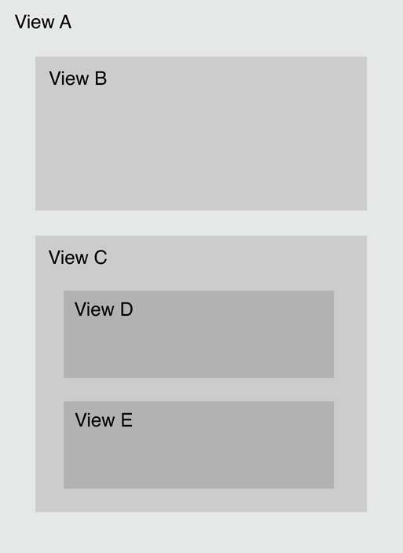

#事件传递：响应链

当你设计应用程序时，你很可能想要动态地响应事件。 比如，一个触摸(touch)事件可以发生在屏幕上的不同对象中，并且对于一个给定事件你必须决定你想要响应哪个对象并理解哪个对象如何接收事件。

当一个用户生成的事件发生时，UIKit创建一个事件对象，它包含了需要处理该事件的各种信息。 然后把事件对象放在活动应用程序的事件队列中。 对于多个触摸事件，对象是一组打包进一个UIEvent对象的触摸事件。 对于运动事件(motion events)，事件对象根据你使用的不同框架以及你感兴趣的不同移动事件类型发生改变。 

事件沿着一个指定的路径传递知道它遇见可以处理它的对象。 首先一个UIApplication 对象从队列顶部获取一个事件并分发(dispatches)它以便处理。 通常，它把事件传递给应用程序的关键窗口对象，该对象把事件传递给一个初始对象来处理。 初始对象取决于事件的类型。

* 触摸事件。 对于触摸事件，窗口对象首先尝试把事件传递给触摸发生的视图。那个视图被称为hit-test(点击测试)视图。 寻找hit-test视图的过程被称为hit-testing, 参见 “Hit-Testing Returns the View Where a Touch Occurred.”

* 运动和远程控制事件。 对于这些事件，窗口对象把shaking-motion(摇晃运动)或远程控制事件传递给第一响应者来处理。第一响应者请参见 “The Responder Chain Is Made Up of Responder Objects.”

这些事件路径的最终目标是找到一个可以处理并相应事件的对象。 因此，UIKit首先把事件传递给最适合处理该事件的对象。 对于触摸事件，最适合处理该事件的对象是hit-test视图，而对于其它事件，那个对象是第一响应者。 以下章节讲述了更多关于如何决定hit-test视图和第一响应者的详情。

##一、Hit-Testing 返回触摸事件发生的视图

iOS 使用hit-testing来找到事件发生的视图。 Hit-testing包括检查触摸事件是否发生在任何相关视图对象的范围内， 如果是，则递归地检查所有视图的子视图。在视图层次中的最底层视图，如果它包含了触摸点，那么它就是hit-test视图。等 iOS决定了hit-test视图之后，它把触摸事件传递给该视图以便处理。

假设用户触摸了视图E。iOS通过以下吮吸检查子视图来查找hit-test视图：

因为触摸发生在视图A范围内，所以它检查子视图B和C。触摸不在视图B范围内，但是它在视图C范围内，所以它检查子视图D和E。触摸没有在视图D范围内，但是它在视图E范围内。视图E是视图层次结构的最底层并且它包含了触摸，因此它是hit-test视图。

hitTest:withEvent: 方法为给定的CGPoint 和 UIEvent返回hit test 视图。hitTest:withEvent:方法通过在自身调用pointInside:withEvent: 方法开始。 如果传递到方法hitTest:withEvent:内的点在视图的范围内，pointInside:withEvent:返回YES。然后，方法递归地给每个子视图调用hitTest:withEvent:方法并返回YES。

 

如果传递到hitTest:withEvent:方法的电不再视图的范围内，pointInside:withEvent:方法返回NO,点被忽视，并且hitTest:withEvent:返回nil. 如果一个子视图返回NO，则视图层次的整个分支都被忽视，因为如果触摸事件没有发生在那个子视图中，那么事件也不会在任何一个该子视图的子视图中发生。 这意味着在一个子视图中的任何点，如果它在其父视图的外面，那么它不能接收触摸事件，因为触摸点必须在父视图和子视图的范围内。但是如果子视图的clipsToBounds 特性被设置为NO时这可以发生。(主意：一个触摸对象在生命周期内都跟它的hit-test视图相关，即使触摸事件在稍候会移出该视图。)

 hit-test是第一处理触摸事件的视图。如果hit-test视图不能处理该事件，事件沿着视图的响应链传递直到系统找到可以处理该事件的视图，响应链在 “The Responder Chain Is Made Up of Responder Objects”中有描述。

##二、响应链由响应者对象组成

很多类型的事件都在事件传递中依赖响应链。 响应链是一系列相连的响应者对象。 它由第一个响应者开始，以应用对象结束。 如果第一响应者不能处理该事件，它把事件传递给响应链中的下一个响应者。

响应者对象是可以响应并处理各种事件的对象。 UIResponder 类是所有响应者对象的基类，它为事件处理和通用响应者行为都定义了可编程接口。 UIApplication, UIViewController, 和UIView的实例都是响应者，就是说所有的视图和大多数主要对象都是响应者。 请注意Core 动画层不是响应者。

第一响应者被设计为首先接收事件。通常，第一响应者是一个视图对象。 一个对象通过实现以下事情可以成为第一响应者：重写 canBecomeFirstResponder 方法并返回YES。

 接收一个becomeFirstResponder 消息。如果必要，一个对象可以给自己发送该消息。

注意：确保你的应用程序在把一个对象分配为第一响应者之前已经建立了它的对象图。比如，通常你重写viewDidAppear: 方法时会调用becomeFirstResponder方法。 如果你尝试在viewWillAppear:方法里分配第一响应者，那么你的对象图还没有建立，因此becomeFirstResponder方法返回NO。

 
事件并不是依赖响应链的唯一对象。响应链可以用于以下所有对象：

 触摸事件。如果hit-test视图无法处理一个触摸事件。该事件在以hit-test视图开始的响应链中往上传递。

 运动事件。 要想用UIKit处理摇晃运动事件，第一响应者必须实现UIResponder类的motionBegan:withEvent: 方法或motionEnded:withEvent: 方法，参见 “Detecting Shake-Motion Events with UIEvent.” 

远程控制事件。 要想处理远程控制事件，第一响应者必须实现UIResponder类的 remoteControlReceivedWithEvent:方法。

 动作消息。当用户操纵一个控件，比如一个按钮或开关，并且操作方法的目标(target)为nil时，消息通过以控件视图开始的响应者链里被发送。

编辑菜单消息。 当用户点击了编辑菜单的命令时，iOS使用一个响应者链来找出实现必要方法的对象(比如cut:, copy:, 以及paste:) 。 更多信息，请看“Displaying and Managing the Edit Menu” 以及示例代码项目，CopyPasteTile.

 文本编辑。 当用户点击一个文本区或一个文本视图时，那视图自动成为第一响应者。 默认情况下，虚拟键盘出现后文本区或文本视图成为可编辑状态。 你可以显示一个自定义输入视图来取代键盘，如果它更适合你的应用程序。 你还可以添加一个自定义输入视图到任何响应者对象。 更多信息，请看 “Custom Views for Data Input”.

UIKit 自动把用户点击的文本区或文本视图设置为第一响应者；应用程序必须明确地通过becomeFirstResponder方法设置所有其它第一响应者对象。

三、响应者链遵循一个特定的传递路径

如果初始对象---hit-test视图或者第一响应者链--不能处理一个事件， UIKit 把事件传递给响应者链中的下一个响应者。 每个响应者决定是否想要处理该事件或者调用nextResponder 方法把该事件传递给它的下个响应者。 该过程一直持续直到找到一个响应者来处理该事件或者没有任何其它响应者。

当iOS侦测到一个事件时，响应者链序列开始并把事件传递给一个初始对象，初始对象通常为一个视图。 初始视图首先可以处理一个事件。 图2-2显示了为两个应用程序配置的两个不同事件传递路径。 应用程序的事件传递路径依赖于它的特定结构， 但是所有的事件传递路径遵循同样的试探法(heuristics)。

对于左边的应用程序，事件沿着以下路径：

1. 初始视图尝试处理事件或消息。 如果它不能处理该事件，它把事件传递给它的父视图，因为初始视图在它的视图控制器的视图层次里不是最顶层视图。 
2. 父视图尝试处理该事件。 如果父视图不能处理该事件，它把事件传递给父视图的父视图，因为该父视图还不是视图层次结构里的最顶层视图。
3. 视图控制器的视图层次结构中的最顶层视图尝试处理该事件。如果它还是不能处理该事件，它把事件传递给它的视图控制器。 
4. 视图控制器尝试处理该事件，如果它不能处理，则把事件传递给窗口。
5. 如果窗口还是不能处理该事件，它把事件传递给单个应用程序对象。
6. 如果应用程序对象还是不能处理该事件，它把事件丢弃。

右边的应用程序沿着稍稍不同的路径，但是所有的事件传递路径遵循这些探索法：

1. 一个视图在它的视图控制器的视图层次中把事件向上传递，直到它达到最顶层视图。
2. 最顶层视图把事件传递给它的视图控制器。
3. 视图控制器把事件传递给它的最顶层视图的父视图。 重复步骤1-3 直到事件到达根视图控制器。
4. 根视图控制器把事件传递给窗口对象。
5. 窗口把事件传递给应用程序对象。

 重要提示： 如果你实现了一个自定义视图用UIKit来处理远程控制事件，操作消息，摇晃运动事件，或者编辑菜单消息，不要直接把事件或消息分配给nextResponder并在响应者链里向上发送。 相反，调用父类的当前事件处理方法的实现方法并且让UIKit为你处理响应者链的遍历。