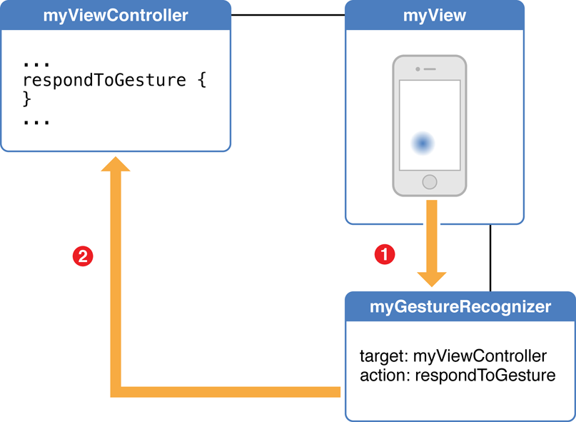
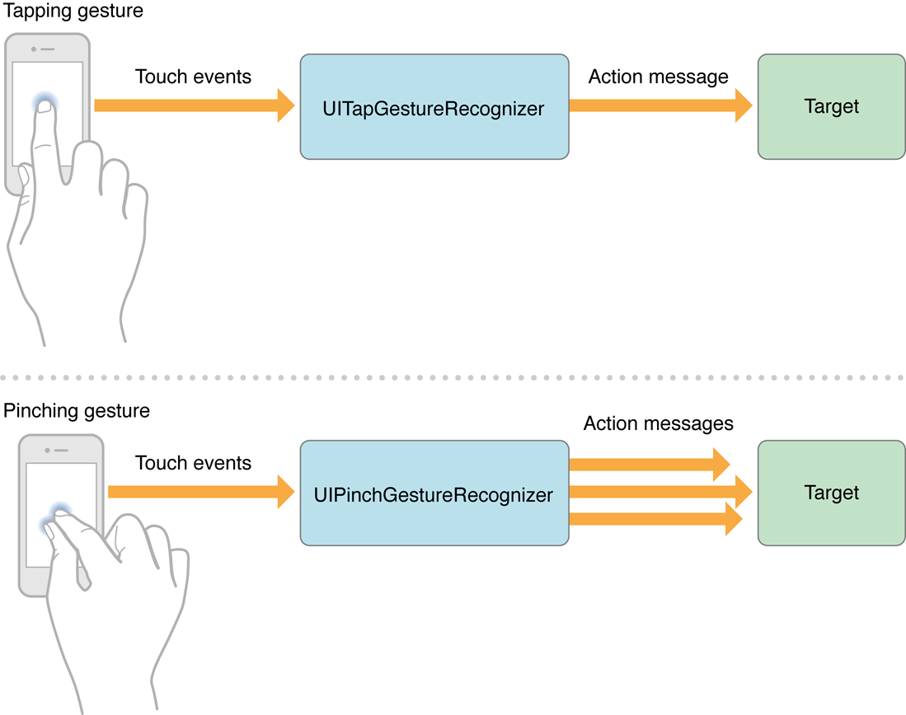
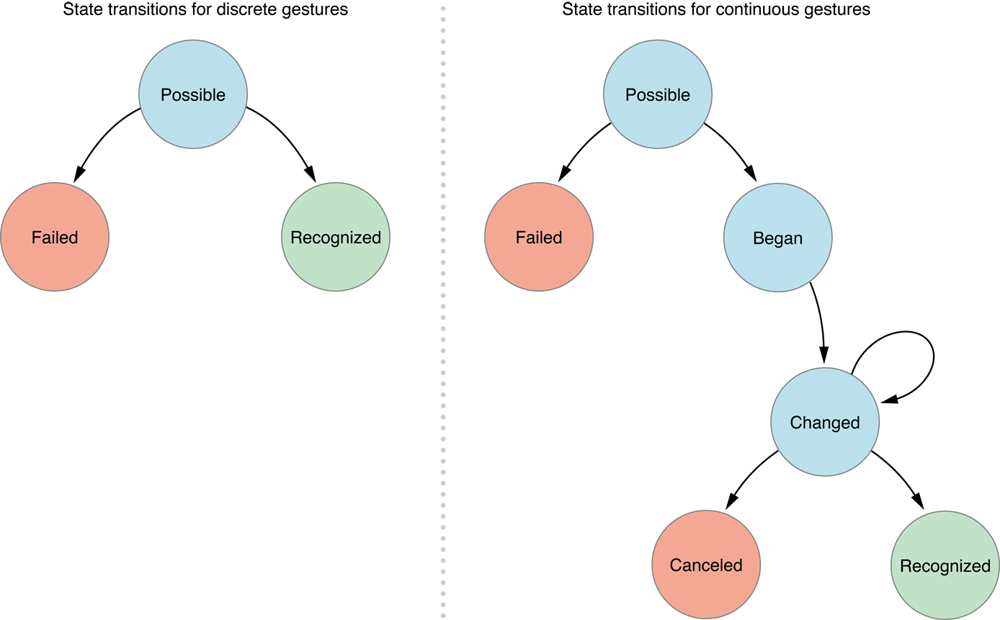
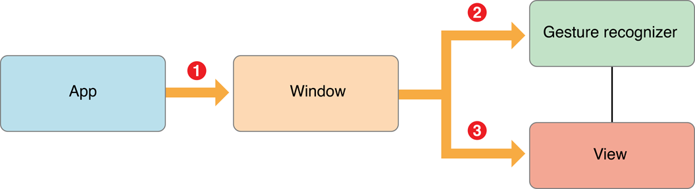
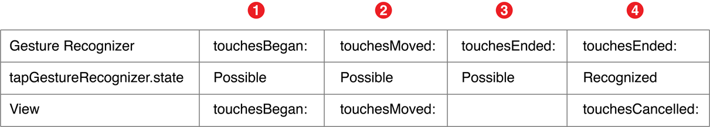

手势识别把低层次的事件处理代码转换为高层次的操作。 它们是你连接到视图的各种对象，它们允许视图像控件一样响应各种操作。 手势识别翻译(interpret)各种触摸来决定它们是否响应一个特定的手势，比如一个点击(swipe), 捏合(pinch)，或旋转。 如果它们识别到它们指定的手势，就给目标对象发送一个操作信息。 目标对象通常是视图的视图控制器，它响应如图1-1中所示的手势。该设计模式既有力又简单；你可以动态地决定视图响应什么操作，你也可以给视图添加各种手势识别而不必要子类化该视图。




一、使用手势识别器来简化事件处理


UIKit 框架提供了一些已经预先定义好的手势识别来侦测各种常用手势。如果可能的话，最好是使用预定义的手势识别，因为它们缩减了你必须写的代码总量。另外，使用一个标准的手势识别而不是自己编写以确保你的应用程序如用户期望的那样工作。


如果你想你的应用程序识别一个独特的手势，比如一个勾或一个漩涡状运动，你可以创建你自己的自定义手势识别。 学习如何设计和实现你自己的手势识别，请看 “Creating a Custom Gesture Recognizer.”


1、内建手势识别来识别各种常用手势


当你设计应用程序时，考虑你想要开启什么手势。  然后，对于每个手势，决定列表1-1中的预定义手势识别是否就足够。


Gesture | UIKit class
:---------|:-------- 
Tapping (any number of taps) | UITapGestureRecognizer 
Pinching in and out (for zooming a view) | UIPinchGestureRecognizer 
Panning or dragging|UIPanGestureRecognizer
Swiping (in any direction)|UISwipeGestureRecognizer
Rotating (fingers moving in opposite directions)|UIRotationGestureRecognizer
Long press (also known as “touch and hold”)|UILongPressGestureRecognizer


你的应用程序应该只以用户期待的方式来响应。 比如，一个捏合动作应该缩放，而轻击动作应该选择一些东西。 关于正确使用手势的指南，请看iOS Human Interface Guidelines 中的 “Apps Respond to Gestures, Not Clicks”。


2、手势识别连接到视图


每个手势识别都跟一个视图相关联。 通常，视图可以有多个手势识别，因为单个视图可能响应多个不同的手势。 要想一个手势识别能够识别在一个特殊视图上发生的各种触摸，你必须把手势识别连接到那个视图。 当用户触摸了那个视图，手势识别先于视图对象接收一个触摸发生的信息。 结果，手势识别可以通过视图的行为来响应各种触摸。


3、 手势触发操作消息


当一个手势识别识别出其制定的手势后，它给它的目标发送一个操作消息。 要想创建一个手势识别，你需要初始化一个目标和一个操作。


1). 离散和连续的手势


手势有离散手势，也有连续手势。 一个离散手势，比如一个轻击(tap)，只发生一次。一个连续手势，比如捏合(pinching)，发生时持续一段时间。 对于离散手势，手势识别就给目标发送一个操作消息。对于连续手势，手势识别则保持发送操作消息给目标直到多点触摸序列结束，如图1-2.



二、用手势识别响应事件


你需要做三件事来添加一个内建手势识别到应用程序：


1. 创建并配置一个手势识别实例. 该步骤包括分配一个目标，操作，以及有时候分配手势指定的各种属性(比如 numberOfTapsRequired).
2. 把手势识别连接到一个视图。
3. 实现处理手势的操作方法。


1、使用界面生成器(Interface Builder)来添加一个手势识别到应用程序


在Xcode里的界面生成器中，添加手势识别到应用程序跟你添加任何对象到用户界面(add any object to your user interface)是一样的---就是从对象库中拖拉手势识别到一个视图。完成该操作后，手势识别自动连接到那个视图。 你可以检查手势识别被连接到了哪个视图，并且如果必要，在nib 文件中更改该连接(change the connection in the nib file)。


当你创建完手势识别对象后，你需要创建并连接一个操作方法(create and connect an action)。任何时候手势识别(gesture recognizer)识别手势时都将调用该方法。如果你需要在该操作方法外面引用手势识别，你还应该为手势识别创建并连接一个输出口 (create and connect an outlet)。你的代码应该跟列表1-1相似.


```
@interface APLGestureRecognizerViewController ()
@property (nonatomic, strong) IBOutlet UITapGestureRecognizer *tapRecognizer;
@end
 
@implementation
- (IBAction)displayGestureForTapRecognizer:(UITapGestureRecognizer *)recognizer
     // Will implement method later...
}
@end
```


2、通过程序添加一个手势识别


你可以通过分配和初始化一个具体(concrete)的UIGestureRecognizer 子类的实例来创建一个手势识别，比如 UIPinchGestureRecognizer 。 当你初始化手势识别时，指定一个目标对象和一个操作选择器(selector)，正如列表1-2中所示，通常目标对象就是视图的视图控制器。


如果你通过程序创建一个手势识别，你需要调用addGestureRecognizer: 方法来把它连接到视图。 列表1-2 创建了一个单个轻击手势识别，指定识别该手势需要一次轻击(tap)，然后把手势识别对象连接到一个视图。 通常，你在视图控制器的 viewDidLoad 方法里创建手势识别，如列表1-2所示。


列表1-2 通过程序创建一个单一的轻击手势识别

```
- (void)viewDidLoad {
     [super viewDidLoad];
 
     // Create and initialize a tap gesture
     UITapGestureRecognizer *tapRecognizer = [[UITapGestureRecognizer alloc]
          initWithTarget:self action:@selector(respondToTapGesture:)];
 
     // Specify that the gesture must be a single tap
     tapRecognizer.numberOfTapsRequired = 1;
 
     // Add the tap gesture recognizer to the view
     [self.view addGestureRecognizer:tapRecognizer];
 
     // Do any additional setup after loading the view, typically from a nib
}
```
3、响应离散手势


当你创建一个手势识别时，你把该识别(recognizer)连接到一个操作方法。使用该操作方法来响应手势识别的手势。列表1-3 提供了一个响应一个离散手势的例子。 当用户轻击了带有手势识别的视图时，视图控制器显示一个图像视图(image view)表示"Tap"发生。  showGestureForTapRecognizer: 方法决定了视图中手势的位置，该位置从recognizer的locationInView: 特性中获取，然后把图片显示到该位置。


注意： 接下来的3段代码例子取自 Simple Gesture Recognizers 样本代码工程，你可以查看它以获得更多上下文。


列表1-3 处理一个双击手势
```
- (IBAction)showGestureForTapRecognizer:(UITapGestureRecognizer *)recognizer {
       // Get the location of the gesture
      CGPoint location = [recognizer locationInView:self.view];
 
       // Display an image view at that location
      [self drawImageForGestureRecognizer:recognizer atPoint:location];
 
       // Animate the image view so that it fades out
      [UIView animateWithDuration:0.5 animations:^{
           self.imageView.alpha = 0.0;
      }];
}
```

每个手势识别都有它自己的特性集。比如，如列表1-4中，showGestureForSwipeRecognizer: 方法使用点击(swipe)手势识别的direction 特性来决定用户是向左清扫还是向右。 然后，它使用该值来让图像从点击方向消失。


列表1-4 响应一个向左或向右清扫手势
```
// Respond to a swipe gesture
- (IBAction)showGestureForSwipeRecognizer:(UISwipeGestureRecognizer *)recognizer {
       // Get the location of the gesture
       CGPoint location = [recognizer locationInView:self.view];
 
       // Display an image view at that location
       [self drawImageForGestureRecognizer:recognizer atPoint:location];
 
       // If gesture is a left swipe, specify an end location
       // to the left of the current location
       if (recognizer.direction == UISwipeGestureRecognizerDirectionLeft) {
            location.x -= 220.0;
       } else {
            location.x += 220.0;
       }
 
       // Animate the image view in the direction of the swipe as it fades out
       [UIView animateWithDuration:0.5 animations:^{
            self.imageView.alpha = 0.0;
            self.imageView.center = location;
       }];
}
```
4、响应连续手势


连续手势允许应用程序在手势发生时响应。 比如，用户可以一边做捏合手势，一边就可以看见缩放，或者允许用户沿着屏幕拖拉一个对象。


列表1-5 以跟手势同样的角度显示一个"Rotate"图片，并且当用户停止旋转时，动画该图片让其在旋转回水平方向的同时消失。 当用户旋转他的手指时，持续调用 showGestureForRotationRecognizer: 方法直到两个手指都拿起。


列表1-5 响应一个旋转手势
```
// Respond to a rotation gesture
- (IBAction)showGestureForRotationRecognizer:(UIRotationGestureRecognizer *)recognizer {
       // Get the location of the gesture
       CGPoint location = [recognizer locationInView:self.view];
 
       // Set the rotation angle of the image view to
       // match the rotation of the gesture
       CGAffineTransform transform = CGAffineTransformMakeRotation([recognizer rotation]);
       self.imageView.transform = transform;
 
       // Display an image view at that location
       [self drawImageForGestureRecognizer:recognizer atPoint:location];
 
      // If the gesture has ended or is canceled, begin the animation
      // back to horizontal and fade out
      if (([recognizer state] == UIGestureRecognizerStateEnded) || ([recognizer state] == UIGestureRecognizerStateCancelled)) {
           [UIView animateWithDuration:0.5 animations:^{
                self.imageView.alpha = 0.0;
                self.imageView.transform = CGAffineTransformIdentity;
           }];
      }
 
}
```

每次调用该方法时，图片都在drawImageForGestureRecognizer: 方法中被设置为不透明。 当手势完成时，图片在animateWithDuration: 方法中被设置为透明。showGestureForRotationRecognizer:方法通过检查手势识别的状态来判断手势是否完成。 关于这些状态的更多信息，请看“Gesture Recognizers Operate in a Finite State Machine.”


三、定义手势识别如何交互


通常情况下，当你把手势识别添加到应用程序时，你需要了解你想要你的识别(recognizers)之间如何发生交互，或者跟应用程序的其它任何触摸事件处理代码如何发生交互。要想完成这些，你首先需要理解更多点关于手势识别如何工作的知识。


1、手势识别在一个有限状态机里操作


手势识别以一种预定义的方式从一个状态过渡到另一个状态。 每种状态都可以根据它们遇到的特定条件(conditions)过渡到几种可能的未来状态中的一种。确切的状态机根据手势识别是离散或是连续会发生变化，正如图1-3中所示。所有的手势识别在一个可能的状态(UIGestureRecognizerStatePossible)中开始， 它们分析接收到的任何多点触摸序列，并且在分析过程中成功识别手势或者识别识别一个手势。失败识别手势意味着手势识别过渡到失败状态     (UIGestureRecognizerStateFailed).




当一个离散手势识别识别出它的手势，手势识别从可能状态过渡到被识别状态  (UIGestureRecognizerStateRecognized) ， 然后识别完成。


对于连续手势，当手势第一次被识别时，手势识别从可能状态开始(UIGestureRecognizerStateBegan)。然后，它从开始状态过渡到改变状态(UIGestureRecognizerStateChanged), 然后当手势发生时又从改变状态变为改变状态。 当用户的最后一个手指从视图上举起时，手势识别过渡到结束状态(UIGestureRecognizerStateEnded), 识别完成。 注意结束状态是识别完成状态的一个别名。


如果一个连续手势不再适应预期的模式时，它的识别还可以从改变状态过渡到取消状态(UIGestureRecognizerStateCancelled)。


每次手势识别改变状态时，手势识别都给它的目标发送一个操作消息，除非它过渡到失败或取消状态。 然而，一个离散手势识别只在它从可能状态过渡到被识别状态时才发送一个单个操作消息。一个连续手势识别在状态发生改变时发送多个操作消息。


当一个手势识别到达被识别(或结束)状态时，它把状态重置为可能(Possible)状态。把状态重置为可能状态不会触发一个操作消息。


2、跟其它手势识别发生交互


一个视图可以带有多个手势。使用视图的gestureRecognizers 特性来确定视图都带有哪些手势识别。 你还可以分别(respectively)使用addGestureRecognizer: 方法和removeGestureRecognizer: 方法添加和删除视图上的手势识别来动态改变视图如何处理手势。


当视图带有多个手势识别时，你可能想要改变竞争(competing)手势识别是如何接收和分析触摸事件。默认情况下，没有设置哪个手势识别首先接收到第一个触摸，因此每次触摸都可以以不同的顺序传送给手势识别。 你可以重写该默认行为来：


指定一个手势识别应该比另一个手势识别优先分析某个触摸。

允许两个手势识别来同时操作。

阻止某个手势识别分析某个触摸

使用UIGestureRecognizer 类方法，委托方法，以及其子类重写的方法来影响这些行为。


1）为两个手势识别声明一个特定顺序


想象一下，你想要识别一个快速滑动(swipe)和一个慢速拖动(pan)手势，你想要用这两个手势触发不同的操作。默认情况下，当用户尝试swipe时，该手势会被理解为一个pan。 这是因为swipe(一个离散手势)手势在满足各种必要条件被理解为一个swipe手势之前，首先满足pan(一个连续手势)手势的各种必要条件。


要想视图同时识别swipes 和pans，你想要swipe手势识别在pan手势之前来分析触摸事件。 如果swipe手势识别已经确定某个触摸是一个swipe， 那么pan手势识别就绝没有必要再去分析该触摸。 如果swipe手势识别确定该触摸不是一个swipe， 它过渡到Failed状态，然后pan手势识别应该开始分析该触摸事件。


你可以通过调用手势识别的requireGestureRecognizerToFail: 方法来说明两个手势识别之间这种类型的关系，如列表1-6所示。在该列表中，两个手势识别都被连接到了相同的视图上。


列表1-6 pan手势识别要求swipe手势识别到达fail状态
```
- (void)viewDidLoad {
       [super viewDidLoad];
       // Do any additional setup after loading the view, typically from a nib
       [self.panRecognizer requireGestureRecognizerToFail:self.swipeRecognizer];
}
```

requireGestureRecognizerToFail: 方法给接收者发送了一个消息，并且指定了一些otherGestureRecognizer，它们必须在接收识别(receiving recognizer)开始工作之前进入Failed 状态。当它等待其它手势识别过渡到Failed状态期间，接收识别(receiving recognizer)始终处于Possible状态。如果其它手势识别失败了，receiving recognizer 开始分析触摸事件并移动到下个状态。换句话说，如果其它手势识别过渡到Recognized 或者 Began状态，receiving recognizer就移动到Failed 状态。 关于状态过渡的更多信息， 请看“Gesture Recognizers Operate in a Finite State Machine.”


注意：如果你的应用程序识别同时支持单击和双击，并且你的单击手势识别不要求双击识别失败，那么即使是用户双击时，你也应该期待在双击操作之前接收单击操作。该行为是有意设计的，因为最好的用户体验通常都开启多种类型的操作。


 如果你想要这两种操作不兼容，你的单击识别必须要求双击识别进入失败状态。 然而，这样你的单击操作会滞后用户的输入，因为单击识别会等到双击识别失败后才开始识别。


2）阻止手势识别分析触摸


你可以通过添加一个委托对象到手势识别来改变手势识别的行为。UIGestureRecognizerDelegate 协议提供了一组方法来阻止手势识别分析触摸。 你可以选择使用协议中的 gestureRecognizer:shouldReceiveTouch: 方法 和  gestureRecognizerShouldBegin: 方法中的一个来使用。


当一个触摸开始时，如果你可以立即确定手势识别是否应该考虑该触摸，使用 gestureRecognizer:shouldReceiveTouch: 方法来实现。每次有新触摸时都调用该方法。 阻止手势识别注意到一个触摸的发生，请返回NO。默认值是YES。该方法不改变手势识别的状态。


列表1-7 使用 gestureRecognizer:shouldReceiveTouch: 委托方法来阻止手势识别接收到来自一个自定义子视图中发生的触摸。

```
- (void)viewDidLoad {
    [super viewDidLoad];
    // Add the delegate to the tap gesture recognizer
    self.tapGestureRecognizer.delegate = self;
}
 
// Implement the UIGestureRecognizerDelegate method
-(BOOL)gestureRecognizer:(UIGestureRecognizer *)gestureRecognizer shouldReceiveTouch:(UITouch *)touch {
    // Determine if the touch is inside the custom subview
    if ([touch view] == self.customSubview){
        // If it is, prevent all of the delegate's gesture recognizers
        // from receiving the touch
        return NO;
    }
    return YES;
}

```

如果你需要在确定手势识别是否应该分析一个触摸之前一直等待。使用 gestureRecognizerShouldBegin: 委托方法。 通常，如果你有一个UIView 或 UIControl子类并带有跟手势识别想冲突的自定义触摸事件处理，你可以使用该方法。返回NO，让手势识别立即进入失败状态，允许其他触摸处理来处理。 当手势识别想要过渡到Possible状态以外的状态时，如果手势识别将阻止一个视图或控件接收一个触摸，该方法被调用。


如果你的视图或视图控制器不能成为手势识别委托，你可以使用UIView的fgestureRecognizerShouldBegin:方法 。该方法的签名和实现是一样的。


3）开启同时手势识别


默认情况下，两个手势识别不能同时识别它们的不同手势。但是，假设你想让用户可以同时捏合并旋转一个视图，你需要改变默认行为，你可以通过调用gestureRecognizer:shouldRecognizeSimultaneouslyWithGestureRecognizer: 方法来实现。该方法是 UIGestureRecognizerDelegate 协议的一个可选方法。 当一个手势识别的手势分析可能阻碍另一个手势识别识别它的手势时可以调用该方法，反之亦然。 该方法默认范围NO。当你想让两个手势同时分析它们的手势时，返回YES。


 注意：你只在一个手势识别需要开启同时识别功能时才需要实现一个委托并返回YES。 然而，它还意味着返回NO并不一定阻止同时识别功能，因为其他手势识别的委托可能返回了YES。


4）给两个手势指定一个单向关系


如果你想要控制两个识别(recognizers)是如何交互，但是你需要指定一个单向关系，你可以重写canPreventGestureRecognizer: 或 canBePreventedByGestureRecognizer: 子类方法并返回NO(默认为YES)。 比如，如果你想用一个旋转手势阻止一个捏合手势，但是你又不想捏合手势阻止一个旋转手势，你可以用如下语句指定。
```
[rotationGestureRecognizer canPreventGestureRecognizer:pinchGestureRecognizer];
```
同时，重写旋转手势识别的子类方法来返回NO. 更多管理如何子类化 UIGestureRecognizer的信息，请看 “Creating a Custom Gesture Recognizer.”


如果没有手势需要阻止另外手势，使用gestureRecognizer:shouldRecognizeSimultaneouslyWithGestureRecognizer: ，它在“Permitting Simultaneous Gesture Recognition.” 里描述。 默认情况下，捏合手势阻止旋转手势，或者旋转手势阻止捏合手势，因为两个手势不能同时被识别。


5) 跟别的用户界面控件交互


在iOS 6.0 或以后版本中，默认控件操作方法防止(prevent)重复手势识别的行为。比如，一个按钮的默认操作是一个单击。如果你有一个单击手势识别绑定到一个按钮的父视图上，然后用户点击该按钮，最后按钮的操作方法接收触摸事件而不是手势识别。 它只用于手势识别跟一个控件的默认操作重复时，包括：


单个手指在UIButton, UISwitch, UIStepper, UISegmentedControl, and UIPageControl 上的单击。

单个手势在 UISlider 上的快速滑动(swipe)，轻扫方向跟slider平行

单个手指的在UISwitch 控件上的慢速拖动(pan)手势，方向跟switch平行。

如果你有一个这些控件的自定义子类，你想要改变其默认操作，把手势识别直接连接到控件而不是连接到其父视图。然后，手势识别首先接收到触摸事件。一如往常，请确保你已经阅读了 iOS Human Interface Guidelines 文档以确保你的应用程序提供了一个直观的用户体验，特别是当你重写一个标准控件的默认行为时。


四、手势识别解读(interpret)原始触摸事件


目前位置，你已经学习了关于手势以及应用程序如何识别并响应它们。 然而，要想创建一个自定义手势识别或想控制时手势别如何跟视图的触摸事件处理相交互，你需要更具体地(specifically)思考触摸和事件的方方面面。


1、一个事件包含了单前多点触摸序列的所有触摸


在iOS中，一个触摸是一个手指在屏幕上的存在或运动。 一个手势有一个或多个触摸，它由UITouch 对象表示。比如，一个pinch-close手势有两个触摸--两个手指在屏幕上从相反方向朝着彼此移动。


 一个事件包含(encompasses)一个多点触摸序列的所有触摸。 一个多点触摸序列以一个手指触摸屏幕开始，以最后一个手指离开屏幕结束。 当一个手指移动时，iOS给事件触摸对象。一个多点触摸事件由 UIEventTypeTouches 类型的UIEvent 对象表示。


每个触摸对象只跟踪一个手指，并且只在触摸序列期间跟踪。 在序列期间，UIKit跟踪手指并更新触摸对象的各种属性。 这些属性包括触摸阶段(phase)，它在视图中的位置，它的前一个位置，以及它的时间戳。


触摸阶段表明一个触摸何时开始，它是移动的还是静止的，以及它何时结束---当手指不再触摸屏幕的时间。 正如图1-4所示，应用程序在任何触摸的每个阶段之间接收事件对象。


图1-4 一个多点触摸序列和触摸阶段


 注意：手指没有鼠标点击精确。 当用户触摸屏幕时，接触的区域实际上是椭圆的，并且会比用户期待的位置稍微篇低。 该接触面会根据手指的尺寸和方向，手指使用时的压力，以及其它因素的不同而发生改变。底层多点触摸系统会替你分析该信息并计算一个单击点，因此你不需要自己写代码来实现它。


2、应用程序在触摸处理方法中接收触摸


在一个多点触摸序列期间，应用程序在新触摸发生或者给出的触摸阶段发生改变时发送这些信息；它调用以下方法：


当一个或多个手指触摸屏幕时调用

当一个或多个手势移动时调用

当一个或多个手指离开屏幕时调用

当触摸序列被系统事件取消时调用，比如有一个来电。

每个方法都跟一个触摸阶段相关联；比如，touchesBegan: 方法跟 UITouchPhaseBegan 方法相关联。 触摸对象的阶段(phase)被存储在其phase 特性里。


 注意： 这些方法跟手势识别状态没有关联，比如UIGestureRecognizerStateBegan 和 UIGestureRecognizerStateEnded等。 手势识别器状态严格表示手势识别器自身的阶段，不表示正在被识别的触摸对象阶段。


五、调节触摸到视图的传递


可能有时候你想要在手势识别器之前接收到一个触摸。但是在你可以改变触摸到视图的传递路径之前，你需要理解其默认行为。在简单情况下，当一个触摸发生时，触摸对象从UIApplication对象传递到UIWindow对象。 然后，窗口首先把触摸发送给触摸发生的视图上关联的任何手势识别器，而不是先发送给视图对象自身。



1、手势识别器首先识别一个触摸


窗口延迟把触摸对象传递给视图，这样手势识别器就可以首先分析触摸。延迟期间，如果手势识别器识别出一个触摸手势，然后窗口就绝不会再把触摸对象传递给视图，并且还取消任何先前传递给视图的任何触摸对象，这些触摸对象都是被识别序列的一部分。比如，如果你有一个手势识别器用来识别一个离散手势，该手势要求一个双手指的触摸，该触摸就会被解释成两个单独的触摸对象。 当触摸发生时，触摸对象从英语程序对象传递到触摸发生视图的窗口对象，然后发生以下序列，请看图1-6。

Figure 1-6  Sequence of messages for touches

图1-6 触摸消息序列



1. 窗口在Began 阶段发送两个触摸对象---通过 touchesBegan:withEvent: 方法---给手势识别器。 手势识别器还不能识别该手势，因此它的状态是Possible. 窗口发送这些同样的触摸给手势识别器相关联的视图。


2. 窗口在Moved阶段发送两个触摸对象---通过touchesMoved:withEvent: 方法---- 给手势识别器。 识别器任然不能侦测该手势，状态还是Possible。 窗口然后发送这些触摸到相关联的视图。


3. 窗口在Ended阶段发送一个触摸对象--- 通过touchesEnded:withEvent: 方法---给手势识别器。 虽然该触摸对象对于手势来说信息还不够，但是窗口还是把该对象扣住(withhold)不发送给视图。


4. 窗口在Ended阶段发送另一个触摸。 手势识别器这是可以识别出该手势，因此把状态设置为Recognized. 就在第一个操作信息被发送之前，视图调用touchesCancelled:withEvent: 方法来使先前在Began 和Moved阶段发送的触摸对象无效(invalidate)。触摸在Ended阶段被取消。

 


现在假设手势识别器在最后一步确定它正在分析的多点触摸序列不是它的手势。它把状态设置为UIGestureRecognizerStateFailed.。 然后窗口在Ended阶段发送这两个触摸对象给相关联的视图---通过touchesEnded:withEvent: 消息。


一个连续手势的手势识别器遵循一个相似的序列，除了它更有可能在触摸对象到达Ended 阶段之前就识别出它的手势。一旦识别出它的手势，它把状态设置为 UIGestureRecognizerStateBegan (而不是Recognized). 窗口把多点触摸序列中的所有子序列触摸对象发送给手势识别器，而不是发送到附属的(attached)视图。


2、影响到视图的各个触摸的传递


你可以改变 UIGestureRecognizer 特性的几个值来改变默认传递路径，让它们以特定的方式传递。如果你改变这些特性的默认值，以下行为将发生变化：


delaysTouchesBegan(默认为NO)---正常情况下，窗口在Began 和 Moved 阶段把触摸对象发送给视图和手势识别器。 把delaysTouchesBegan设置为YES,使得窗口不会在Began阶段把触摸对象发送给视图。 这样做确保一个手势识别器识别它的手势时，没有把部分触摸事件传递给相连的视图。 设置该特性时请谨慎，因为它会使你的界面反应迟钝。


delaysTouchesEnded(默认为YES)---当该特性被设置为YES时，它确保视图不会完成一个动作，而该动作是手势可能想在稍候取消的。当一个手势识别器正在分析一个触摸事件时，窗口不会不会在Ended阶段传递触摸对象到相连的视图。如果一个手势识别器识别出它的手势，则触摸对象被取消。 如果手势识别器没有识别出它的手势，窗口通过一个touchesEnded:withEvent:消息把这些对象传递给视图。设置该特性为NO，允许视图和手势识别器可以同时在Ended阶段分析触摸对象。

例如，设想一个视图有一个点击手势识别器，它要求双击，然后用户双击了该视图。 把特性设置为YES后，视图获得touchesBegan:withEvent:, touchesBegan:withEvent:, touchesCancelled:withEvent:, 以及 touchesCancelled:withEvent: 信息序列。如果该特性被设置为NO，视图获得以下信息序列：touchesBegan:withEvent:, touchesEnded:withEvent:, touchesBegan:withEvent:, andtouchesCancelled:withEvent: ，它表示在touchesBegan:withEvent: 消息中，视图可以识别一个双击。
If a gesture recognizer detects a touch that it determines is not part of its gesture, it can pass the touch directly to its view. To do this, the gesture recognizer callsignoreTouch:forEvent: on itself, passing in the touch object.

如果一个手势识别器侦测到一个不属于该手势的触摸，它可以把该触摸直接传递给它的视图。 要想实现它，手势识别器对自己调用ignoreTouch:forEvent:方法，它在触摸对象中传递。


六、创建一个自定义手势识别器


要想实现一个自定义手势识别器，首先在Xcode里创建一个 UIGestureRecognizer 的子类。然后，在子类的头文件中加入以下import指令。

```
#import <UIKit/UIGestureRecognizerSubclass.h>
```


下一步，从UIGestureRecognizerSubclass.h中拷贝以下方法声明到你的头文件；这些是你在子类中需要重写的方法。

```
- (void)reset;
- (void)touchesBegan:(NSSet *)touches withEvent:(UIEvent *)event;
- (void)touchesMoved:(NSSet *)touches withEvent:(UIEvent *)event;
- (void)touchesEnded:(NSSet *)touches withEvent:(UIEvent *)event;
- (void)touchesCancelled:(NSSet *)touches withEvent:(UIEvent *)event;
```


这些方法跟早先在“An App Receives Touches in the Touch-Handling Methods.” 中所描述的相关触摸事件处理有完全相同的签名和行为。 在所有这些需要重写的方法中，你必须调用父类的实现，即使该方法有一个null实现。


注意：UIGestureRecognizerSubclass.h中的 state 特性目前是readwrite状态，而不是readonly,就跟它在UIGestureRecognizer.h中一样。 你的子类可以通过给特性分配 UIGestureRecognizerState 常量(constants)来改变其状态。


1、为自定义手势识别器实现触摸事件处理方法


一个自定义手势识别器实现的核心是四个方法： touchesBegan:withEvent:, touchesMoved:withEvent:,touchesEnded:withEvent:, and touchesCancelled:withEvent:. 在这些方法中，你通过设置一个手势识别器的状态，把低层触摸事件解析为手势识别。列表1-8创建了一个离散单击勾选(checkmark)手势的手势识别器。 它记录了手势的中心点---即勾的上升开始点---这样客户就可以获取这个值。


该例子只有一个单一视图，但是大多是应用程序都有多个视图。一般来说，你应该把触摸位置转换为屏幕的坐标系，这样你就可以正确的识别出跨越(span)多个视图的手势。


列表1-8 一个勾(checkmark)手势识别器的实现

```
#import <UIKit/UIGestureRecognizerSubclass.h>
 
// Implemented in your custom subclass
- (void)touchesBegan:(NSSet *)touches withEvent:(UIEvent *)event {
    [super touchesBegan:touches withEvent:event];
    if ([touches count] != 1) {
        self.state = UIGestureRecognizerStateFailed;
        return;
    }
}
 
- (void)touchesMoved:(NSSet *)touches withEvent:(UIEvent *)event {
    [super touchesMoved:touches withEvent:event];
    if (self.state == UIGestureRecognizerStateFailed) return;
    UIWindow *win = [self.view window];
    CGPoint nowPoint = [touches.anyObject locationInView:win];
    CGPoint nowPoint = [touches.anyObject locationInView:self.view];
    CGPoint prevPoint = [touches.anyObject previousLocationInView:self.view];
 
    // strokeUp is a property
    if (!self.strokeUp) {
        // On downstroke, both x and y increase in positive direction
        if (nowPoint.x >= prevPoint.x && nowPoint.y >= prevPoint.y) {
            self.midPoint = nowPoint;
            // Upstroke has increasing x value but decreasing y value
        } else if (nowPoint.x >= prevPoint.x && nowPoint.y <= prevPoint.y) {
            self.strokeUp = YES;
        } else {
            self.state = UIGestureRecognizerStateFailed;
        }
    }
}
 
- (void)touchesEnded:(NSSet *)touches withEvent:(UIEvent *)event {
    [super touchesEnded:touches withEvent:event];
    if ((self.state == UIGestureRecognizerStatePossible) && self.strokeUp) {
        self.state = UIGestureRecognizerStateRecognized;
    }
}
 
- (void)touchesCancelled:(NSSet *)touches withEvent:(UIEvent *)event {
    [super touchesCancelled:touches withEvent:event];
    self.midPoint = CGPointZero;
    self.strokeUp = NO;
    self.state = UIGestureRecognizerStateFailed;
}

```

离散手势和连续手势的状态过渡是不一样的，正如在 “Gesture Recognizers Operate in a Finite State Machine.” 中所描述。 当你创建一个自定义手势识别器时，你通过给它分配响应的状态来表明(indicate)它是离散手势或是连续手势。比如，列表1-8 中的复选标记(checkmark)手势识别器，它不会把状态设置为Began 或者 Changed，因为它是离散手势。


当你子类化一个手势识别器时，最重要的事情是正确地设置手势识别器的state。 为了手势识别器的的交互如预期，iOS需要了解一个手势识别器的状态。比如，如果你想要实现同时识别或者要求一个手势识别器失败，iOS需要了解识别器的当前状态。


关于创建自定义手势识别器的更多信息，请看 WWDC 2012: Building Advanced Gesture Recognizers.


2. 重置手势识别器的状态


如果你的手势识别器过渡到Recognized/Ended, Canceled, 或者Failed状态，UIGestureRecognizer 类刚好在手势识别器过渡回Possible状态前调用reset 方法。


实现reset 方法来重置任何内部状态，这样你的识别器能准备进行识别手势的一个新的尝试，正如列表1-9所示。当手势识别器从该方法返回后，它将不再接收任何在进行的触摸更新。


列表1-9 重置一个手势识别器
```
- (void)reset {
    [super reset];
    self.midPoint = CGPointZero;
    self.strokeUp = NO;
}
 
```