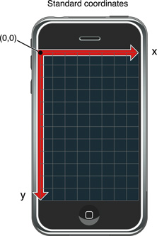

UIKit中的坐标是基于这样的坐标系统：以左上角为坐标的原点，原点向下和向右为坐标轴正向。坐标值由浮点数来表示，内容的布局和定位因此具有更高的精度，还可以支持与分辨率无关的特性。图2-3显示了这个相对于屏幕的坐标系统，这个坐标系统同时也用于UIWindow和UIView类。视图坐标系统的方向和Quartz及Mac OS X使用的缺省方向不同，选择这个特殊的方向是为了使布局用户界面上的控件及内容更加容易。

您在编写界面代码时，需要知道当前起作用的坐标系统。每个窗口和视图对象都维护一个自己本地的坐标系统。视图中发生的所有描画都是相对 于视图本地的坐标系统。但是，每个视图的边框矩形都是通过其父视图的坐标系统来指定，而事件对象携带的坐标信息则是相对于应用程序窗口的坐标系统。为了方 便，UIWindow和UIView类都提供了一些方法，用于在不同对象之间进行坐标系统的转换。

虽然Quartz使用的坐标系统不以左上角为原点，但是对于很多Quartz调用来说，这并不是问题。在调用视图的drawRect:方法之前，UIKit会自动对描画环境进行配置，使左上角成为坐标系统的原点，在这个环境中发生的Quartz调用都可以正确地在视图中描画。您唯一需要考虑不同坐标系统之间差别的场合是当您自行通过Quartz建立描画环境的时候。