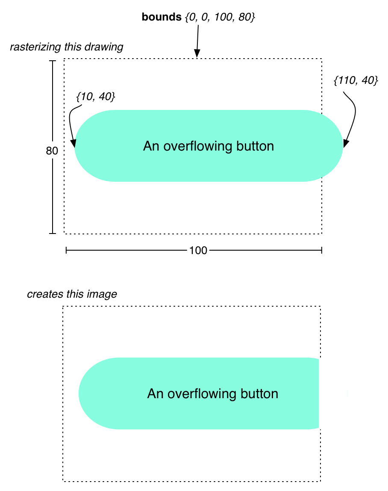
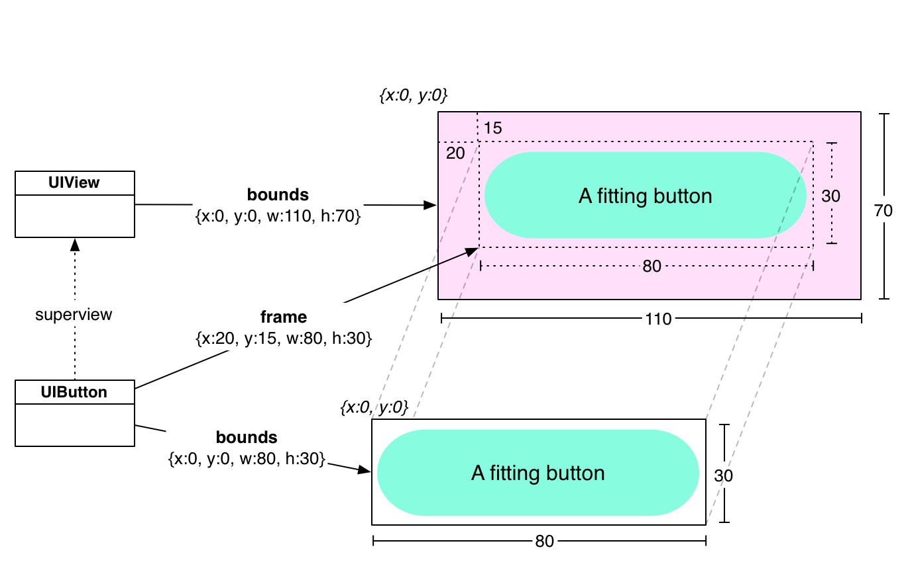
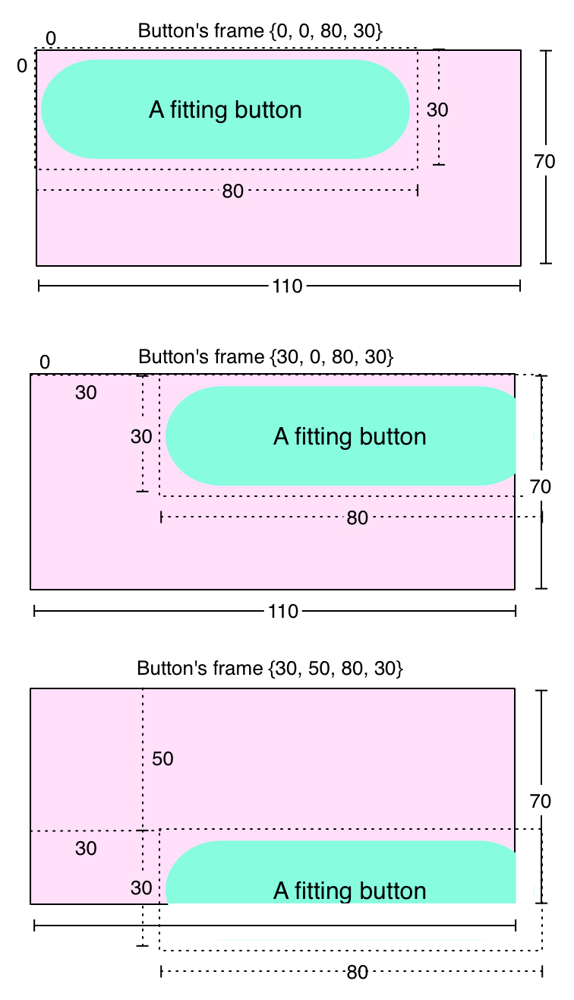
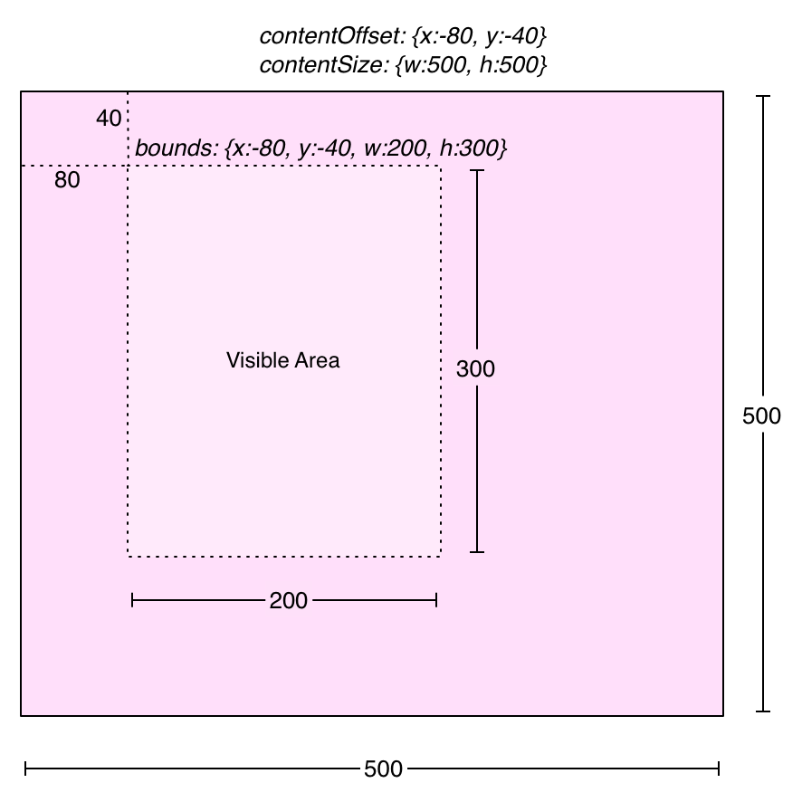
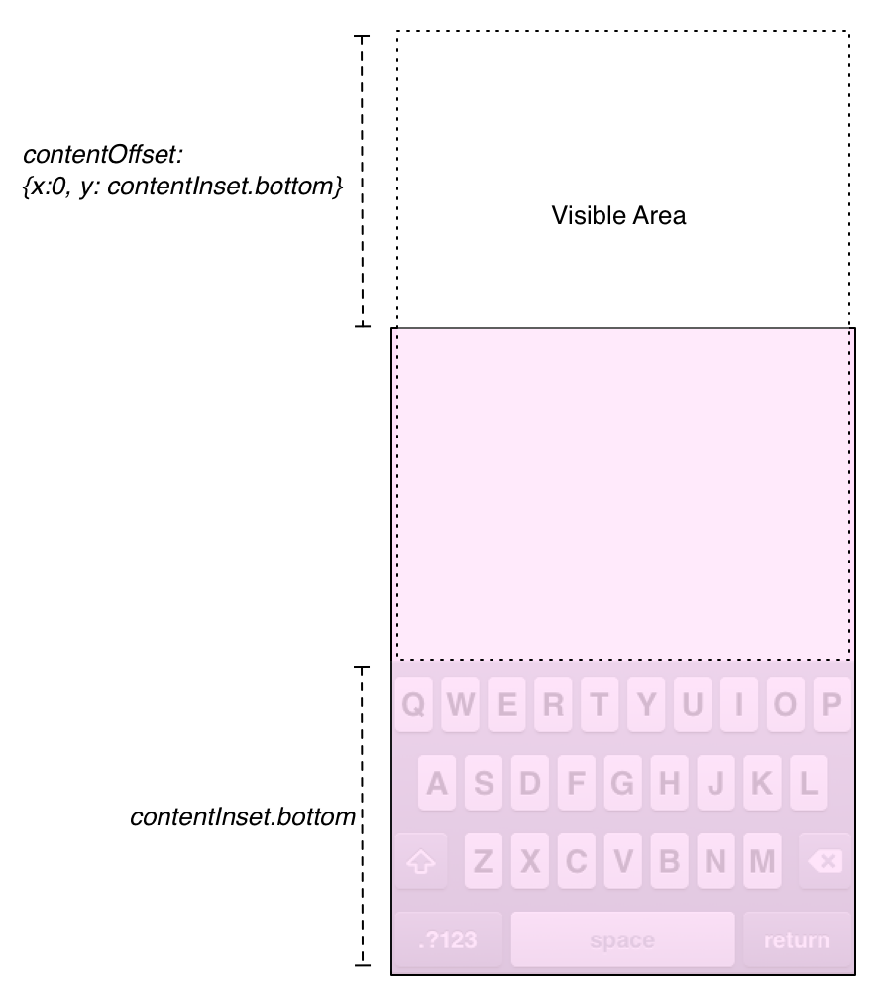

# UISCrollView详解

UITableView的父类是UIScrollView。当然我们要实现一个TableView也需要继承自UIScrollView，那么我们就需要看一下UIScrollView的一些属性和方法。

可能你很难相信，UIScrollView和一个标准的UIView差异并不大，scroll view确实会多一些方法，但这些方法只是UIView一些属性的表面而已。因此，要想弄懂UIScrollView是怎么工作之前，你需要了解 UIView，特别是视图渲染过程的两步。


## 光栅化和组合

渲染过程的第一部分是众所周知的光栅化，光栅化简单的说就是产生一组绘图指令并且生成一张图片。比如绘制一个圆角矩形、带图片、标题居中的UIButtons。这些图片并没有被绘制到屏幕上去；取而代之的是，他们被自己的视图保持着留到下一个步骤用。

一旦每个视图都产生了自己的光栅化图片，这些图片便被一个接一个的绘制，并产生一个屏幕大小的图片，这便是上文所说的组合。视图层级(view hierarchy)对于组合如何进行扮演了很重要的角色：一个视图的图片被组合在它父视图图片的上面。然后，组合好的图片被组合到父视图的父视图图片上 面，就这样。。。最终视图层级最顶端是窗口(window)，它组合好的图片便是我们看到的东西了。

概念上，依次在每个视图上放置独立分层的图片并最终产生一个图片，单调的图像将会变得更容易理解，特别是如果你以前使用过像Photoshop这样的工具。我们还有另外一篇文章详细解释了像素是如何绘制到屏幕上去的。

现在，回想一下，每个视图都有一个bounds和frame。当布局一个界面时，我们需要处理视图的frame。这允许我们放置并设置视图的大小。 视图的frame和bounds的大小总是一样的，但是他们的origin有可能不同。弄懂这两个工作原理是理解UIScrollView的关键。

在光栅化步骤中，视图并不关心即将发生的组合步骤。也就是说，它并不关心自己的frame(这是用来放置视图的图像)或自己在视图层级中的位置(这 是决定组合的顺序)。这时视图只关心一件事就是绘制它自己的content。这个绘制发生在每个视图的drawRect:方法中。

在drawRect:方法被调用前，会为视图创建一个空白的图片来绘制content。这个图片的坐标系统是视图的bounds。几乎每个视图 bounds的origin都是{0，0}。因此，当在删格化图片左上角绘制一些东西的时候，你都会在bounds的origin({x:0,y:0}) 处绘制。在一个图片右下角的地方绘制东西的时候，你都会绘制在{x:width, y:height}处。如果你的绘制超出了视图的bounds，那么超出的部分就不属于删格化图片的部分了，并且会被丢弃。



在组合的步骤中，每个视图将自己光栅化图片组合到自己父视图的光栅化图片上面。视图的frame决定了自己在父视图中绘制的位置，frame的 origin表明了视图光栅化图片左上角相对父视图光栅化图片左上角的偏移量。所以，一个origin为{x:20,y:15}的frame所绘制的图片 左边距其父视图20点，上边距父视图15点。因为视图的frame和bounds矩形的大小总是一样的，所以光栅化图片组合的时候是像素对齐的。这确保了 光栅化图片不会被拉伸或缩小。



记住，我们才仅仅讨论了一个视图和它父视图之间的组合操作。一旦这两个视图被组合到一起，组合的结果图片将会和父视图的父视图进行组合。。。这是一个雪球效应。

考虑一下组合图片背后的公式。视图图片的左上角会根据它frame的origin进行偏移，并绘制到父视图的图片上：

```
CompositedPosition.x = View.frame.origin.x - Superview.bounds.origin.x;  
   
CompositedPosition.y = View.frame.origin.y - Superview.bounds.origin.y;  
```
我们可以通过几个不同的frames看一下： 


这样做是有道理的。我们改变button的frame.origin后，它会改变自己相对紫色父视图的位置。注意，如果我们移动button直到它 的一部分已经在紫色父视图bounds的外面，当光栅化图片被截去时这部分也将会通过同样的绘制方式被截去。然而，技术上讲，因为iOS处理组合方法的原 因，你可以将一个子视图渲染在其父视图的bounds之外，但是光栅化期间的绘制不可能超出一个视图的bounds。

Scroll View的Content Offset

现在，我们所讲的跟UIScrollView有什么关系呢？一切都和它有关！考虑一种我们可以实现的滚动：我们有一个拖动时frame不断改变的视 图。这达到了相同的效果，对吗？如果我拖动我的手指到右边，那么拖动的同时我增大视图的origin.x，瞧，这货就是scroll view。

当然，在scroll view中有很多具有代表性的视图。为了实现这个平移功能，当用户移动手指时，你需要时刻改变每个视图的frames。当我们提出组合一个view的光栅化图片到它父视图什么地方时，记住这个公式：

```
CompositedPosition.x = View.frame.origin.x - Superview.bounds.origin.x;  
   
CompositedPosition.y = View.frame.origin.y - Superview.bounds.origin.y;  
```
我们减少Superview.bounds.origin的值(因为他们总是0)。但是如果他们不为0呢？我们用和前一个图例相同的frames，但是我们改变了紫色视图bounds的origin为{-30,-30}。得到下图：




现在，巧妙的是通过改变这个紫色视图的bounds，它每一个单独的子视图都被移动了。事实上，这正是一个scroll view工作的原理。当你设置它的contentOffset属性时：它改变scroll view.bounds的origin。事实上，contentOffset甚至不是实际存在的。代码看起来像这样：

- (void)setContentOffset:(CGPoint)offset  
{  
    CGRect bounds = [self bounds];  
    bounds.origin = offset;  
    [self setBounds:bounds];  
}  
注意：前一个图例，只要足够的改变bounds的origin，button将会超出紫色视图和button组合成的图片的范围。这也是当你足够的移动scroll view时，一个视图会消失！

世界之窗：Content Size

现在，最难的部分已经过去了，我们再看看UIScrollView另一个属性：contentSize。scroll view的content size并不会改变其bounds的任何东西，所以这并不会影响scroll view如何组合自己的子视图。反而，content size定义了可滚动区域。scroll view的默认content size为{w:0,h:0}。既然没有可滚动区域，用户是不可以滚动的，但是scroll view任然会显示其bounds范围内所有的子视图。

当content size设置为比bounds大的时候，用户就可以滚动视图了。你可以认为scroll view的bounds为可滚动区域上的一个窗口：



当content offset为{x:0,y:0}时，可见窗口的左上角在可滚动区域的左上角处。这也是content offset的最小值；用户不能再往可滚动区域的左边或上边移动了。那儿没啥，别滚了！

content offset的最大值是content size和scroll view size的差。这也在情理之中：从左上角一直滚动到右下角，用户停止时，滚动区域右下角边缘和滚动视图bounds的右下角边缘是齐平的。你可以像这样记 下content offset的最大值：

```
contentOffset.x = contentSize.width - bounds.size.width;  
contentOffset.y = contentSize.height - bounds.size.height;  
```
用Content Insets对窗口稍作调整

contentInset属性可以改变content offset的最大和最小值，这样便可以滚动出可滚动区域。它的类型为UIEdgeInsets，包含四个值： {top，left，bottom，right}。当你引进一个inset时，你改变了content offset的范围。比如，设置content inset顶部值为10，则允许content offset的y值达到10。这介绍了可滚动区域周围的填充。


这咋一看好像没什么用。实际上，为什么不仅仅增加content size呢？除非没办法，否则你需要避免改变scroll view的content size。想要知道为什么？想想一个table view（UItableView是UIScrollView的子类，所以它有所有相同的属性），table view为了适应每一个cell，它的可滚动区域是通过精心计算的。当你滚动经过table view的第一个或最后一个cell的边界时，table view将content offset弹回并复位，所以cells又一次恰到好处的紧贴scroll view的bounds。

当你想要使用UIRefreshControl实现拉动刷新时发生了什么？你不能在table view的可滚动区域内放置UIRefreshControl，否则，table view将会允许用户通过refresh control中途停止滚动，并且将refresh control的顶部弹回到视图的顶部。因此，你必须将refresh control放在可滚动区域上方。这将允许首先将content offset弹回第一行，而不是refresh control。

但是等等，如果你通过滚动足够多的距离初始化pull-to-refresh机制，因为table view设置了content inset，这将允许content offset将refresh control弹回到可滚动区域。当刷新动作被初始化时，content inset已经被校正过，所以content offset的最小值包含了完整的refresh control。当刷新完成后，content inset恢复正常，content offset也跟着适应大小，这里并不需要为content size做数学计算。(这里可能比较难理解，建议看看EGOTableViewPullRefresh这样的类库就应该明白了)

如何在自己的代码中使用content inset？当键盘在屏幕上时，有一个很好的用途：你想要设置一个紧贴屏幕的用户界面。当键盘出现在屏幕上时，你损失了几百个像素的空间，键盘下面的东西全都被挡住了。

现在，scroll view的bounds并没有改变，content size也并没有改变(也不需要改变)。但是用户不能滚动scroll view。考虑一下之前一个公式：content offset的最大值并不同于content size和bounds的大小。如果他们相等，现在content offset的最大值是{x:0,y:0}.

现在开始出绝招，将界面放入一个scroll view。scroll view的content size仍然和scroll view的bounds一样大。当键盘出现在屏幕上时，你设置content inset的底部等于键盘的高度。




这允许在content offset的最大值下显示滚动区域外的区域。可视区域的顶部在scroll view bounds的外面，因此被截取了(虽然它在屏幕之外了，但这并没有什么)。

但愿这能让你理解一些滚动视图内部工作的原理，你对缩放感兴趣？好吧，我们今天不会谈论它，但是这儿有一个有趣的小窍门：检查 viewForZoomingInScrollView:方法返回视图的transform属性。你将再次发现scroll view只是聪明的利用了UIView已经存在的属性。
