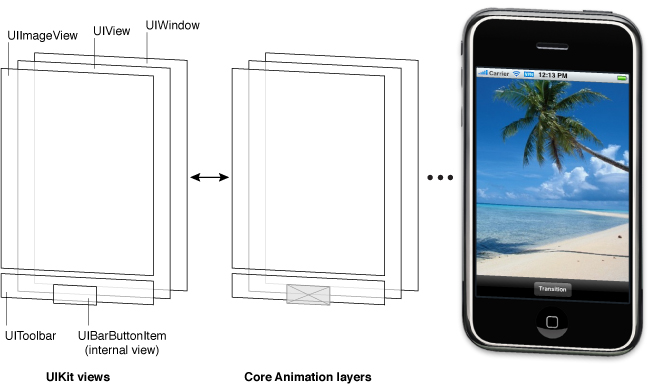
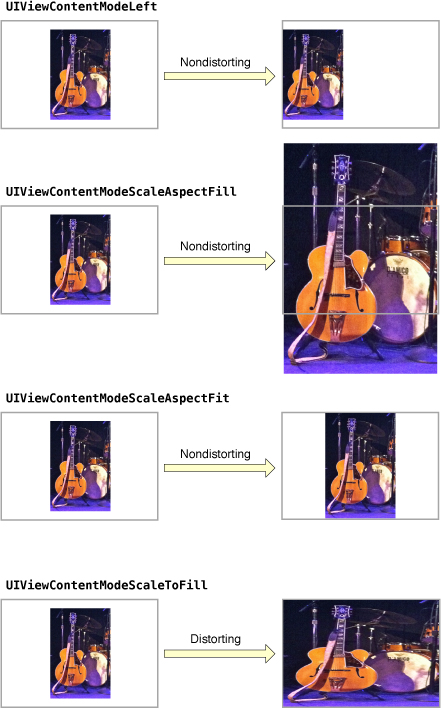
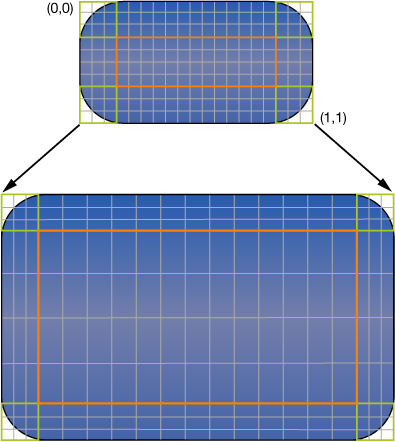
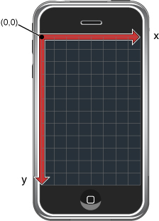
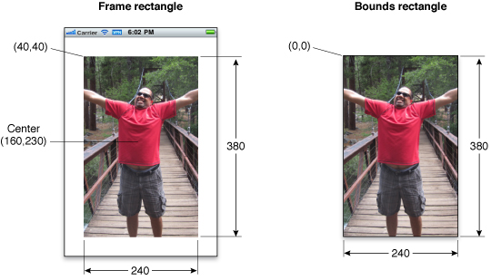
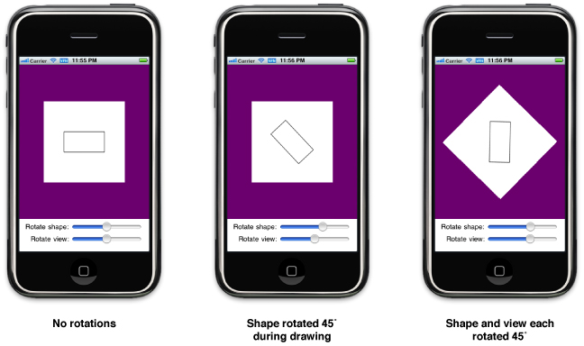
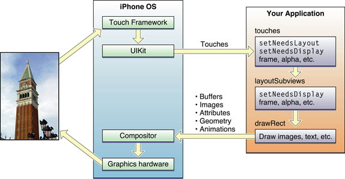

视图和窗口架构
视图和窗口展示了应用的用户界面，同时负责界面的交互。UIKit和其他系统框架提供了很多视图，你可以就地使用而几乎不需要修改。当你需要展示的内容与标准视图允许的有很大的差别时，你也可以定义自己的视图。
 
不管你是使用系统的视图还是创建自己的视图，你需要理解UIView和UIWindow类所提供的基本结构。这些类提供了复杂的方法来管理视图的布局和展示。理解这些方法的工作非常重要，使你在应用发生改变时可以确认视图有合适的行为。
 
 
视图架构 
 
大部分你想要可视化操作都是由视图对象－即UIView类的实例－来进行的。一个视图对象定义了一个屏幕上的一个矩形区域，同时处理该区域的绘制和触屏事件。一个视图也可以作为其他视图的父视图，同时决定着这些子视图的位置和大小。UIView类做了大量的工作去管理这些内部视图的关系，但是需要的时候你也可以定制默认的行为。
 
视图与Core Animation层联合起来处理着视图内容的解释和动画过渡。每个UIKit框架里的视图都被一个层对象支持（通常是一个CALayer类的实例），它管理管理着后台的视图存储和处理视图相关的动画。然而，当你需要对视图的解释和动画行为有更多的控制权时，你可以使用层。
 
为了理解视图和层之间的关系，我们可以借助于一些例子。图1－1显示了ViewTransitions样例程序的视图层次及其对底层Core Animation层的关系。应用中的视图包括了一个window(同时也是一个视图)，一个通用的表现得像一个容器视图的UIView对象，一个图像视图，一个控制显示用的工具条，和一个工具条按钮(它本身不是一个视图但是在内部管理着一个视图)。（注意这个应用包含了一个额外的图像视图，它是用来实现动画的）。为了简化，同时因为这个视图通常是被隐藏的，所以没把它包含在下面的图中。每个视图都有一个相应的层对象，它可以通过视图礶r属性被访问。（因为工具条按钮不是一个视图，你不能直接访问它的层对象。）在它们的层对象之后是Core Animation的解释对象，最后是用来管理屏幕上的位的硬件缓存。
 
 

 
 
 
 
 
使用Core Animation的层对象有很重要的性能意义。一个视图对象的绘制代码需要尽量的少被调用，当它被调用时，其绘制结果会被Core Animation缓存起来并在往后可以被尽可能的重用。重用已经解释过的内容消除了通常需要更新视图的开销昂贵的绘制周期。内容的重用在动画中特别重要，我们可以使用已有的内容，这样比创建新的内容开销更小。
 
 
视图层次和子视图管理
 
除了提供自己的内容之外，一个视图也可以表现得像一个容器。当一个视图包含其他视图时，就在两个视图之间创建了一个父子关系。在这个关系中孩子视图被当作子视图，父视图被当作超视图。创建这样一个关系对应用的可视化和行为都有重要的意义。
 
在视觉上，子视图隐藏了父视图的内容。如果子视图是完全不透明的，那么子视图所占据的区域就完全的隐藏了父视图的相应区域。如果子视图是部分透明的，那么两个视图在显示在屏幕上之前就混合在一起了。每个父视图都用一个有序的数组存储着它的子视图，存储的顺序会影响到每个子视图的显示效果。如果两个兄弟子视图重叠在一起，后来被加入的那个（或者说是排在子视图数组后面的那个）出现在另一个上面。
 
父子视图关系也影响着一些视图行为。改变父视图的尺寸会连带着改变子视图的尺寸和位置。在这种情况下，你可以通过合适的配置视图来重定义子视图的尺寸。其他会影响到子视图的改变包括隐藏父视图，改变父视图的alpha值，或者转换父视图。
 
视图层次的安排也会决定着应用如何去响应事件。在一个具体的视图内部发生的触摸事件通常会被直接发送到该视图去处理。然而，如果该视图没有处理，它会将该事件传递给它的父视图，在响应者链中以此类推。具体视图可能也会传递事件给一个干预响应者对象，像视图控制器。如果没有对象处理这个事件，它最终会到达应用对象，此时通常就被丢弃了。
 
 
 
 
视图绘制周期
 
UIView类使用一个点播绘制模型来展示内容。当一个视图第一次出现在屏幕前，系统会要求它绘制自己的内容。在该流程中，系统会创建一个快照，这个快照是出现在屏幕中的视图内容的可见部分。如果你从来没有改变视图的内容，这个视图的绘制代码可能永远不会再被调用。这个快照图像在大部分涉及到视图的操作中被重用。
 
如果你确实改变了视图内容，也不会直接的重新绘制视图内容。相反，使用setNeedsDisplay或者setNeedsDisplayInRect:方法废止该视图，同时让系统在稍候重画内容。系统等待当前运行循环结束，然后开始绘制操作。这个延迟给了你一个机会来废止多个视图，从你的层次中增加或者删除视图，隐藏，重设大小和重定位视图。所有你做的改变会稍候在同一时间反应。
 
注意：改变一个视图的几何结构不会自动引起系统重画内容。视图的contentMode属性决定了改变几何结构应该如果解释。大部分内容模式在视图的边界内拉伸或者重定位了已有快照，它不会重新创建一个新的快照。获取更多关于内容模式如果影响视图的绘制周期，查看 content modes
 
当绘制视图内容的时候到了时，真正的绘制流程会根据视图及其配置改变。系统视图通常会实现私有的绘制方法来解释它们的视图，（那些相同的系统视图经常开发接口，好让你可以用来配置视图的真正表现。）对于定制的UIView子类，你通常可以覆盖drawRect:方法并使用该方法来绘制你的视图内容。也有其他方法来提供视图内容，像直接在底部的层设置内容，但是覆盖drawRect:时最通用的技术。
 
 
内容模式
 
视图的内容模式控制着视图如何回收内容来响应视图几何结构的变化，也控制着是否需要回收内容。当一个视图第一次显示时，它通常会解释内容，其结果会被底层的层级树捕获为一张位图。在那之后，改变视图的几何结构不会导致重新创建位图。相反，视图中contentMode属性的值决定着这张位图是否该被拉伸，以适应新的边界或者只是简单的被放到角落或者视图的边界。
 
视图的内容模式在你进行如下操作时被应用：
 
改变视图frame或者bounds矩形的宽度或者高度时。
 
赋值给视图的transform属性，新的转换包括一个放缩因子。
 
大部分视图的contentMode值是UIViewContentModeScaleToFiill，它使视图的内容被放缩到适合新框架的值。Figure 1-2展示了使用其他可用的内容模式的结果。正如你在图中所看到的那样，不是所有的内容模式都可以填充视图的范围，可以的模式可能会扭曲内容。
 
内容模式很好的支持了视图的内容回收，但是当你想视图在放缩和重设尺寸的操作中重绘你也可以用UIViewContentModeRedraw内容模式。设置这个值绘强制系统调用视图的drawRect:方法来响应几何结构的变化。通常来讲，你应该尽可能的避免使用这个模式，同时你不应该在标准的系统视图中使用这个模式。
 
获取更多骨干与可用的内容模式，查看UIView Class Reference
 
 

 
拉伸视图
 
你可以指定视图的某部分为可拉伸的，以便当视图的尺寸改变时只有可拉伸的部分被影响到。可拉伸的部分通常给按钮或者其他的部分为重复模式的视图。由你指定的可拉伸区域允许沿着两条或者其中一条轴拉伸。当然，当一个视图沿着两条轴拉伸的时候，视图的边界必须也定义了一个重复的模式来避免任何的扭曲。Figure1-3展示了这种扭曲在视图里是怎么表现自己的。每个视图里的原始像素的颜色都自我复制，以便可以填充更大视图的相应区域。
 
 

 
 
你可以用contentStretch属性来定义一个视图的可拉伸区域。这个属性的值一个边的值被标准化为0.0到1.0之间的矩形。当拉伸这个视图时，系统将视图的当前边界值和放缩因子乘以标准值，以便决定哪些像素需要被拉伸。使用标准值可以减轻每次改变视图的边界值都更新contentStretch属性的需要。
 
视图的内容模式也在决定如何视图的可拉伸区域的使用中扮演着重要的角色。只有当内容模式可能绘引起视图内容放缩的时候可拉伸区域才会被使用。这意味这你的可拉伸视图只被UIViewContentModeScaleToFill, UIViewContentModeScaleAspectFit和UIViewContentModeScaleAspectFill内容模式。如果你指定了一个将内容弹到边界或者角落的内容模式（这样就没有真正的放缩内容），这个视图会忽视可拉伸区域。
 
注意：当需要创建一个可拉伸UIImage对象作为视图的背景时，使用contentStretch属性是推荐的。可拉伸视图完全被Core Animation层处理，这样性能通常更好。
 
 
 
嵌入式动画支持
 
使用层对象来支持视图的其中一个利益是你可以轻松的用动画处理视图相关的改变。动画是与用户进行信息交流的一个有用的方法，而且应该总是在进行应用设计的过程中考虑使用动画。UIView类的很多属性是动画化的－也就是，可以半自动的从一个值动画的变化到另一个值。为了实现这样一个动画，你需要做的只是：
1 告诉UIKit你想要实现一个动画
2 改变这个属性的值
在一个UIView对象中有以下的动画化属性：
frame - 你可以使用这个来动画的改变视图的尺寸和位置
bounds - 使用这个可以动画的改变视图的尺寸
center － 使用这个可以动画的改变视图的位置
transform － 使用这个可以翻转或者放缩视图
alpha － 使用这个可以改变视图的透明度
backgroundColor － 使用这个可以改变视图的背景颜色
contentStretch - 使用这个可以改变视图内容如何拉伸
 
动画的一个很重要的地方是用于从一组视图到另一组视图的过渡。通常来说，会用一个视图控制器来管理关系到用户界面的主要变更的动画。例如，涉及到从高层到底层信息的导航的界面，通常会使用一个导航控制器来管理视图的过渡，这些视图显示了数据的每一个连续层面。然而，你也可以使用动画来创建两组视图的过渡，而不是视图控制器。当你想用一个系统提供的视图控制器无法支持的导航方案时你可能会这样做。
 
除了用UIKit类可以创建动画外，你也可以用Core Animation层来创建动画。在更低层你有更多的在时间或者动画属性上的控制权。
 
获取更多关于如何创建一个基于视图的动画，查看 Animations
获取更多关于使用Core Animation创建动画的信息，查看Core Animation Programming Guide和Core Animation Cookbook.
 
 
视图几何结构和坐标系统
 
UIKit的默认坐标系统把原点设置在左上角，两条轴往下和右扩展。做标志被表示为浮点数，这样允许内容的精确布局和定位而不管底层的屏幕。Figure1-4展示了相对于屏幕的坐标系统。除了屏幕坐标系统窗口和视图也定义了它们自己的本地坐标系统，这样允许你指定相对于视图或者窗口原点的坐标而不是屏幕。
 
 

 
 
因为每个视图和窗口都定义了它自己的本地坐标系统，你需要留意在任何时间内是哪个坐标系统在起作用。每次绘制或者改变一个视图都是基于一个坐标系统的。在某些绘制中会基于视图本身的坐标系统。在某些几何结构变更中是基于父视图的坐标系统的。UIWindow和UIView类都包含了帮助你从一个坐标系统转换到另一个的方法。
 
重要：一些iOS技术定义了默认的坐标系统，它们的原点和方向与UIKit的不同。；例如，Core Graphics和OpenGL ES的坐标系统是原点在可视区域的左下角，而y轴往上递增。当绘制或者创建内容时，你的代码应该考虑到一些不同并且适应坐标值。
 
 
 
frame, bounds和center属性之间的关系
 
视图对象使用frame, bounds和center属性来跟踪它的尺寸和位置：
frame属性包含了frame矩形，指定了在父视图坐标系统中该视图的尺寸和位置。
center属性包含了在父视图坐标系统中的已知中心点。
bounds属性包含了边界矩形，指定了在视图本地坐标系统中视图的尺寸。
主要使用center和frame属性来控制当前视图的几何结构。例如，当在运行时构建你的视图层次或者改变视图的尺寸或者位置时你可以使用这些属性。如果你只是要改变视图的位置，那么推荐使用center属性。center属性的值永远是可用的，即使添加了放缩或者转换因子到视图的转换矩阵当中。但是对于frame属性却不是，当视图的转换矩形不等于原始矩阵时它被当作时无效的。
 
在绘制的过程中主要使用bounds属性。这个边界矩阵在视图的本地坐标系统被解释。这个矩形的默认原点是（0， 0），它的尺寸也适应frame矩形的尺寸。任何绘制在这个矩形当中的东西都是该视图的可视内容的一部分。如果你改变了bounds矩形的原点，任何你绘制在新矩形的东西都会变成该视图可视内容的一部分。
 
Figure1-5展示了一个图像视图的frame和bounds矩形之间的关系。图中，图像视图的右上角被定位在父视图坐标系统的（40， 40），它的矩形尺寸为240x380。对于bounds矩形，原点是（0， 0），矩形尺寸也是240x380。
 
 

 
即使你可以独立的改变frame，bounds和center属性，其中一个改变还是会影响到另外两个属性：
当你设置了frame属性，bounds属性的尺寸值也改变来适应frame矩形的新尺寸。center属性也会改变为新frame矩形的中心值。
当你设置了center属性，frame的原点也会相应的改变。
当你设置了bounds属性，frame属性会改变以适应bounds矩形的新尺寸。
视图的框架默认不会被它的父视图框架裁剪。这样的化，任何放置在父视图外的子视图都会被完整的解释。你可以改变这种行为，改变父视图的clipsToBounds属性就可以。不管子视图是否在视觉上被裁剪，触屏事件总是发生在目标视图父视图的bounds矩形。换句话说，如果触摸位于父视图外的那部分视图，那么该事件不会被发送到该视图。
 
 
 
坐标系统转换矩阵
 
坐标系统转换矩阵给改变视图（或者是它的视图）提供了一个轻松和简易的方法。一个仿射转换是一个数学矩阵，它指定了在坐标系统中的点是怎么被映射到另一个坐标系统中的点。你可以对整个视图应用仿射转换，以基于其父视图来改变视图的尺寸，位置或者朝向。你也可以在你的绘制代码中应用仿射转换，以对已解释内容的独立部分实现相同的操控。如何应用仿射转换是基于这样的上下文的：
为了修改整个视图，可以修改视图transform属性的仿射转换值。
 
为了在视图中的drawRect:方法中修改内容的指定部分，可以修改与当前图形上下文相关的仿射转换。
 
当你想实现动画时，通常可以修改视图的transform属性值。例如，你可以使用这个属性来制作一个视图围绕中心点翻转的动画。你不应该在其父视图的坐标空间中用这个属性来永久的改变你的视图，像修改它的位置和尺寸。对于这种类型的改变，你可以修改视图的frame矩形。
 
注意：当修改视图的transform属性值时，所有的转换都是基于视图的中心点来实现的。
 
在视图的drawRect:方法中，你可以使用仿射转换来定位或者翻转你想要绘制的项目。相对于在视图某些部位中修正对象的位置，我们更倾向于相对于一个固定点去创建对象，通常是（0， 0），同时在绘制之前使用转换来定位对象。这样的话，如果在视图中对象的位置改变了，你要做的只是修改转换矩阵，这样比为对象重新创建新的位置性能更好开销更低。你可以通过使用CGContextGetCTM方法来获取关于图形上下文的仿射转换，同时可以用Core Graphics的相关方法在绘制中来设置或者修改这个转换矩阵。
 
当前转换矩阵（CTM）是一个在任何时候都被使用的仿射矩阵。当操控整个视图的几何结构时，CTM就是视图transform属性的值。在drawRect:方法中，CTM是关于图形上下文的仿射矩阵。
 
每个子视图的坐标系统都是构建在其祖先的坐标系统之上的。所以当你修改一个视图的transform属性，这个改变会影响到视图及其所有的子视图。然而，这些改变只会影响到屏幕上视图的最终解释。因为每个视图都负责绘制自己的内容和对自己的子视图进行布局，所以在绘制和布局的过程中它可以忽略父视图的转换。
 
Figure1- 6描述了在解释的时候，两个不同的转换因子是如何在视觉上组合起来的。在视图的drawRect:方法中，对一个形状应用一个45度的转换因子会使该形状翻转指定的角度。另外加上一个45度的转换因子会导致整个形状翻转90度。这个形状对于绘制它的视图来讲仍然只是翻转了45度，但是视图自己的转换让它看起来像使翻转了90度。
 
Figure 1-6 翻转一个视图和它的内容
 

 
重要：如果一个视图的transform属性不是其定义时转换矩阵，那么视图的frame属性是未定义的而且必须被忽略。当对视图应用转换时，你必须使用视图的bounds和center属性来获取视图的位置和尺寸。子视图的frame矩形仍然是有效的，因为它们与视图的bounds相关。
 
获取更多关于在运行时修改视图的transform属性，查看 “Translating, Scaling, and Rotating Views.”获取更多如何在绘制过程中使用转换来定位内容，查看 Drawing and Printing Guide for iOS.
 
 
 
点与像素
 
在iOS中，所有的坐标值和距离都被指定为使用浮点数，其单元值称为点。点的数量随着设备的不同而不同，而且彼此不相关。要明白关于点的最主要一点是它们提供了一个绘制用的固定框架。
 
Table 1-1 列出了不同iOS设备的分辨率（点度量）。前为宽后为长。只要你依照这些屏幕的尺寸来设计用户界面，你的视图就回被相应的设备正确显示。
 
Table 1-1 
 

Device|Screen dimensions (in points) 
------|-------
iPhone and iPod touch|320 x 480
iPad | 768 x 1024
 
 
每一种使用基于点度量系统的设备都定义了一个用户坐标空间。这是几乎在你所有的代码都会用到的标准坐标空间。例如，当你要操控视图的几何结构或者调用Core Graphics方法来绘制内容时会用到点和用户坐标空间。即使有时用户坐标空间里的坐标时直接映射到设备屏幕的像素，你还是永远不应该假设这是永远不变的。相反，你应该记住：
<strong>一个点并不一定对应着屏幕上的一个像素</strong>
在设备层面，所有由你指定的视图上的坐标在某些点上必须被转化成像素。然而，从用户坐标空间上的点到设备坐标空间上的像素通常由系统来处理。UIKit和Core Graphics都主要使用基于向量的绘制模型，所有的坐标值都被指定为使用点。这样，如果你用Core Graphics画了一条曲线，你会用一些值来指定这条曲线，而不管底层屏幕使用怎样的解决方法。
 
当你需要处理图像或者其他基于像素的技术，像OpenGL ES时，iOS会帮你管理这些像素。对于存储为应用程序的束中的资源的静态图像文件，iOS定义了一些约定，可以指定不同像素密度的图像，也可以在加载图像时最大限度的适应当前屏幕的解决方案。视图也提供了关于当前放缩因子的信息，以便你可以适当的调整任何基于像素的绘制代码来适应有更高级解决方案的屏幕。在不同屏幕的解决方案中处理基于像素内容的技术可以在"Supporting High-Resolution Screens"和"Drawing and Printing Guide for iOS"找到描述。
 
 
 
视图的运行时交互模型
 
当用户和界面进行交互时，或者由代码程序性的改变一些东西时，一系列复杂的事件就会发生在UIKit的内部来处理这些交互。在这个系列中的某些点，UIKit唤出你的视图类，同时给它们一个机会去响应程序的行为。理解这些唤出点对于理解视图在哪里融入系统很重要。Figure 1-7 展示了这些事件的基本序列，从用户触屏开始到图形系统更新屏幕内容来响应结束。同样的事件序列也会发生在任何程序性启动的动作。
 
 

 
以下的步骤分解了图1－7中的事件序列，既解释了在每一步发生了什么，也解释了应用如何响应
1 用户触屏
2 硬件报告触摸事件给UIKit框架
3 UIKit框架将触摸事件打包成UIEvent对象，同时分发给适合的视图。（对于UIKit框架如何提交事件给视图的详细解释，查看 Event Handing Guide for iOS）
4 视图中的事件处理代码可能进行以下的动作来响应：
改变视图或者其子视图的属性（frame， bounds， alpha， 等等）
调用setNeedsLayout方法以标记该视图（或者它的子视图）为需要进行布局更新
调用setNeedsDisplay或者setNeedsDisplayInRect:方法以标记该视图（或者它的子视图）需要进行重画
通知一个控制器关于一些数据的更新
当然，哪些事情要做，哪些方法要被调用是由视图来决定的。
5 如果一个视图的几何结构改变了，UIKit会根据以下几条规则来更新它的子视图：
a 如果自动重设尺寸的规则在发生作用，UIKit会根据这些规则来调整视图。获取更多关于自动重设尺寸规则如何工作，查看"Handling Layout Changes Automatically Using Autoresizing Rules."
b 如果视图实现了layoutSubviews方法，UIKit会调用它。你可以在你的定制视图中覆盖这个方法同时用它来调整任何子视图的位置和大小。例如，一个提供了巨大滚动区域的视图会需要使用几个子视图作为“瓦块”而不是创建一个不太可能放进内存的巨大视图。在这个方法的实现中，视图会隐藏任何屏幕外的子视图，或者重定位它们然后用来绘制新的可视内容。作为这个流程的一部分，视图的布局代码也可以废止任何需要被重画的视图。
6 如果任何视图的任何部分被标记为需要重画，UIKit会要求视图重画自身。
对于显式的定义了drawRect:方法的定制视图，UIKit会调用这个方法。这方法的实现应该尽快重画视图的指定区域，并且不应该再做其他事。不要在这个点上做额外的布局，也不要改变应用的数据模型。提供这个方法仅仅是为了更新视图的可视内容。
标准的系统视图通常不会实现drawRect:方法，但是也会在这个时候管理它们的绘制。
 
7 任何已经更新的视图会与应用余下的可视内容组合在一起，同时被发送到图形硬件去显示。
8 图形硬件将已解释内容转化到屏幕上。
 
注意：上面的更新模型主要应用于使用标准系统视图和绘制技术的应用。使用OpenGL ES来绘制的应用通常会配置一个单一的全屏视图和直接绘制相关的OpenGL图像上下文。你的视图还是应该处理触屏事件，但是它是全屏的，毋需给子视图布局或者实现drawRect:方法。获取更多关于使用OpenGL ES的信息，查看 OpenGL ES Programming Guide for iOS.
 
给定之前的一系列步骤，将自己的定制视图整合进去的方法包括：
事件处理方法：
touchesBegan:withEvent:
touchesMoved:withEvent:
touchesEnded:withEvent:
touchesCancelled:withEvent:
layoutSubviews方法
drawRect:方法
这些是视图的最常用的覆盖方法，但是你可能不需要覆盖全部。如果你使用手势识别来处理事件，你不需要覆盖事件处理方法。相似的，如果你的视图没有包含子视图或者它的尺寸不会改变，那就没有理由去覆盖layoutSubviews方法。最后，只有当视图内容会在运行时改变，同时你要用UIKit或者Core Graphics等本地技术来绘制时才需要用到drawRect。
 
要记住这些是主要的整合点，但是不仅仅只有这些。UIView类中有些方法是专门设计来给子类覆盖的。你应该到UIView Class Reference中查看这些方法的描述，以便在定制时清楚哪些方法适合给你覆盖。
 
 
 
有效使用视图的提示
 
当你需要绘制一些标准系统视图不能提供的内容时，定制视图是很有用的。但是你要负责保证视图的性能要足够的高。UIKit会尽可能的优化视图相关的行为，也会帮助你提高性能。然而，考虑一些提示可以帮助到UIKit。
 
重要：在调整绘制代码之前，你应该一直收集与你视图当前性能有关的数据。估量当前性能让你可以确定是否真的有问题，同时如果真的有问题，它也提供一个基线，让你在未来的优化中可以比较。
 
 
视图不会总是有一个相应的视图控制器
 
在应用中，视图和视图控制器之间的一对一关系是很少见的。视图控制器的工作是管理一个视图层次，而视图层次经常是包含了多个视图，它们都有自包含特性。对于iPhone应用，每个视图层次通常都填满了整个屏幕，尽管对于iPad应用来说不是。
 
当你设计用户界面的时候，考虑到视图控制器的所扮演的角色是很重要的。视图控制器提供了很多重要的行为，像协调视图的展示，协调视图的剔除，释放内存以响应低内存警告，还有翻转视图以响应界面的方向变更。逃避这些行为会导致应用发生错误。
 
获取更多关于视图控制器的信息，查看 View Controller Programming Guide for iOS
 
 
最小化定制的绘画
 
尽管定制的绘画有时是需要的，但是你也应该尽量避免它。真正需要定制绘画的时候是已有的视图类无法提供足够的表现和能力时。任何时候你的内容都应该可以被组装到其他视图，最好结果时组合那些视图对象到定制的视图层次。
 
利用内容模式
 
内容模式可以最小化重画视图要花费的时间。默认的，视图使用UIViewContentModeScaleToFill 内容模式，这个模式会放缩视图的已有内容来填充视图的frame矩形。需要时你可以改变这个模式来调整你的内容，但是应该避免使用UIViewContentModeRedraw内容模式。不管哪个内容模式发生作用，你都可以调用setNeedsDisplay或者setNeedsDisplayInRect:方法来强制视图重画它的内容。
 
可能的话将视图声明为不透明
 
UIKit使用opaque属性来决定它是否可以优化组合操作。将一个定制视图的这个属性设置为YES会告诉UIKit不需要解释任何在该视图后的内容。这样可以为你的绘制代码提高性能并且是推荐的。当然，如果你将这个属性设置为YES，你的视图一定要用不透明的内容完全填充它的bounds矩形。
 
滚动时调整视图的绘制行为
 
滚动会导致数个视图在短时间内更新。如果视图的绘制代码没有被适当的调整，滚动的性能会非常的缓慢。相对于总是保证视图内容的平庸，我们更倾向于考虑滚动操作开始时改变视图行为。例如，你可以暂时减少已解释的内容，或者在滚动的时候改变内容模式。当滚动停止时，你可以将视图返回到前一状态，同时需要时更新内容。
 
 
不要嵌入子视图来定制控制
 
尽管在技术上增加子视图到标准系统控制对象－继承自UIControl的类－是可行的，你还是永远不应该用这种方法来定制它们。控制对象支持定制，它们有显式并且良好归档的接口。例如，UIButton类包含了设置标题和背景图片的方法。使用已定义好的定制点意味着你的代码总是会正确的工作。不用这些方法，而嵌入一个定制的图像视图或者标签到按钮中去会导致应用出现未预期的结果。
