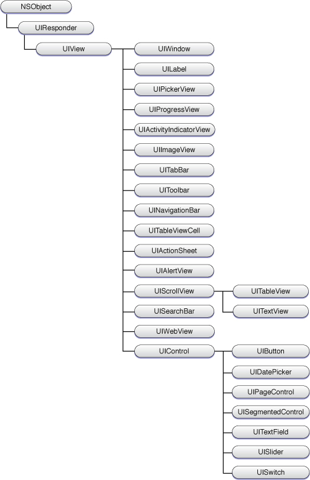

UIView类定义了视图的基本行为，但并不定义其视觉表示。相反，UIKit通过其子类来为像文本框、按键、及工具条这样的标准界面元素定义具体的外观和行为。图2-1显示了所有UIKit视图类的层次框图。除了UIView和UIControl类是例外，这个框图中的大多数视图都设计为可直接使用，或者和委托对象结合使用。

图2-1  视图的类层次

这个视图层次可以分为如下几个大类：

    容器

    容器视图用于增强其它视图的功能，或者为视图内容提供额外的视觉分隔。比如，UIScrollView类可以用于显示因内容太大而无法显示在一个屏幕上的视图。UITableView类是UIScrollView类的子类，用于管理数据列表。表格的行可以支持选择，所以通常也用于层次数据的导航—比如用于挖掘一组有层次结构的对象。

    UIToolbar对象则是一个特殊类型的容器，用于为一或多个类似于按键的项提供视觉分组。工具条通常出现在屏幕的底部。Safari、Mail、和Photos程序都使用工具条来显示一些按键，这些按键代表经常使用的命令。工具条可以一直显示，也可以根据应用程序的需要进行显示。

    控件

    控件用于创建大多数应用程序的用户界面。控件是一种特殊类型的视图，继承自UIControl超类，通常用于显示一个具体的值，并处理修改这个值所需要的所有用户交互。控件通常使用标准的系统范式（比如目标-动作模式和委托模式）来通知应用程序发生了用户交互。控件包括按键、文本框、滑块、和切换开关。

    显示视图

    控件和很多其它类型的视图都提供了交互行为，而另外一些视图则只是用于简单地显示信息。具有这种行为的UIKit类包括UIImageView、 UILabel、UIProgressView、UIActivityIndicatorView。

    文本和web视图

    文本和web视图为应用程序提供更为高级的显示多行文本的方法。UITextView类支持在滚动区域内显示和编辑多行文本；而UIWebView类则提供了显示HTML内容的方法，通过这个类，您可以将图形和高级的文本格式选项集成到应用程序中，并以定制的方式对内容进行布局。

    警告视图和动作表单

    警告视图和动作表单用于即刻取得用户的注意。它们向用户显示一条消息，同时还有一或多个可选的按键，用户通过这些按键来响应消息。警告视图和动作表单的功能类似，但是外观和行为不同。举例来说，UIAlertView类在屏幕上弹出一个蓝色的警告框，而UIActionSheet类则从屏幕的底部滑出动作框。

    导航视图

    页签条和导航条和视图控制器结合使用，为用户提供从一个屏幕到另一个屏幕的导航工具。在使用时，您通常不必直接创建UITabBar和UINavigationBar的项，而是通过恰当的控制器接口或Interface Builder来对其进行配置。

    窗口

    窗口提供一个描画内容的表面，是所有其它视图的根容器。每个应用程序通常都只有一个窗口。更多信息请参见“UIWindow的作用”部分。

除了视图之外，UIKit还提供了视图控制器，用于管理这些对象。更多信息请参见“视图控制器的作用”部分。