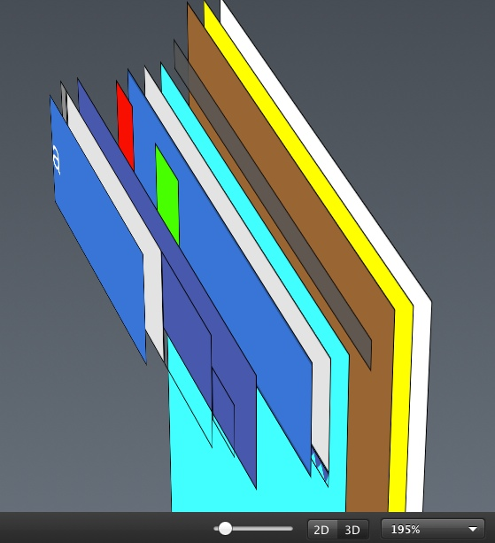

#Z-Order布局

不知道读者有没有试图想过当我们的一个程序真正运行起来的时候，那些被我们实例化的UIView和他们的子类们是以怎样的形态出现在我们的屏幕上的。前面我们介绍了IOS的几何布局框架，而通过这些框架组合起来的UIView和其子类们组成了什么东西？

是一个树形结构，或者准确说是一个倒金字塔结构。我们先看一张3D的DZTableView在只有一个Cell时候的结构图：

通过这张图我们能够非常明显的看到这是一个一层叠一层结构。最先面的是UIWindow的实例，我们的DZTableVIew还有其他一些自定义的控件们，一层叠一层的堆在了UIWindow的实例上面。我们再换个角度看一下：


这张图是个典型的树结构的图，一层层展开就是之后就是我们的DZTableView。通过这两张图比较形象的展示，出DZTableview最后在空间上成了一个什么东西。是的，是“空间”。用这两张图的主要目的就是，希望读者能够在自己的脑海中构建起对于UIView层次数Z-order（z轴）的概念。因为除了除了我布局UIView的各种子类的实例对象的时候，除了布局其二维属性```frame```等，其实我们还需要布局他们的3维属性，即Z-order顺序。

那我们来看看UIKit给我们提供了哪些函数来做这个事情：

```
– addSubview:
– bringSubviewToFront:
– sendSubviewToBack:
– removeFromSuperview
– insertSubview:atIndex:
– insertSubview:aboveSubview:
– insertSubview:belowSubview:
– exchangeSubviewAtIndex:withSubviewAtIndex:
– isDescendantOfView:

//属性部分
 superview  property
 subviews  property
 window  property
```

这些函数通过他们的名字很容易理解他们的意思。```addSubView:```直接将一个View附加在当前View上面。而这个附加过程，可以暂时先简单的理解成一个堆栈的PUSH操作。先附加的View被压在下面，后附加的View在最上面。在暂时把其他函数抛在一遍的情况下，和对堆栈的操作一样，我们是通过UIView的添加顺序（LILO）来控制视图的Z-Order的。但是和堆栈不同的是，UIView没有提供POP操作。因为实际上，解释一个视图中其子视图的比较好的模型是可随机访问的数组，类似于NSArray。不同的是，在父视图中没有直接删除子视图操作。删除操作下放给了我子视图。如果一个要移除一个视图，我们需要调用子视图的```removeFromSuperview```方法，来将其从父视图的层次数种移除。然后其他视图就像你在一堆积木中，抽了比较下面的一根一样，在其下放的保持原先的顺序不动，在其上方的自动下落，添补被抽离的积木造成的空缺，z-order的顺序自动减一。

我曾经思考过，为什么UIKit在设计的时候，不直接在父视图中完成所有的子视图层次数的操作，而是把删除的操作放到了子视图中。刚开始从设计的角度去考虑，像增删改查这些基本的操作不应该放在一起吗？放在一起的话，能够降低子视图和父视图之间的耦合。全部都在父视图中做了，子视图只是一个被统治而已。这样的模型比较简单，也比较好理解。后来在世界的编程实现中，慢慢体会到了apple那群牛逼的工程师的用心良苦。个人认为这绝对是他们对实际编程经验的一个提炼。我们在附加视图的时候，一半都是有了一个父视图的实例有了一个子视图的实例，然后将子视图附加在父视图上，而这个过程一半都是在父视图的类的某些成员函数中进行的。在父视图的成员函数中进行，我们能够非常方便的获取当前视图（父视图）和其子视图的实例，然后调用```addSubView```函数。而在删除的时候，我们一般都是在子视图中进行的。直接在子视图的类的某个函数中，当检测到子视图满足一定的状态的时候，将其删除。而在子视图中相对来说获取父视图的实例编程是比较啰嗦的：

```
//假设UIView存在一个函数removeSubView:那么这个过程是
[self.superView removeSubView:self]
//而removeSubView大概要做这么几个事情

....
- （void） removeSubView:(UIView*)a
{
	//确定是否有这个子视图
	if([self isContentSubView:a])
	{
		//找到子视图的Z-order
		int index = [self indexOfSubView:a];
		//删除掉
		[self removeSubViewAtIndex:index];
	}
}
```

何必要获取一遍父视图的实例进行删除操作呢，直接把这个过程封装起来，用一句：
```[self removeFromSuperView]```多好啊。
而且即使在父视图进行层次数操作的时候，也是有了子视图的实例之后进行操作：
```[aView removeFromeSuperView]```。这种封装，应该属于实用性的一种封装。细细品味，很有味道。

而其他的调整子视图的Z-Order的函数，通过函数名字我们也很容易理解。

1. ```insertSubview:atIndex:```直接将一个子视图加到特定的位置。
2. ```insertSubview:aboveSubview:```将一个子视图加到一个相对位置，在特定视图的上方。
3. ```insertSubview:belowSubview:```将一个子视图加到一个相对位置，在特定视图的下方。
4.  ```exchangeSubviewAtIndex:withSubviewAtIndex:```交换两个特定位置的视图
5.  ```bringSubviewToFront```将一个视图挪到最上方。
6.   ```sendSubviewToBack```将一个视图挪到最下方。

而我们其实在调整视图的Z-order的时候，是否想过调整Z-order用什么用呢？想当然的一个答案是，视图不就是层次结构的嘛，有个Z-order也很正常。但是，如果我们能够完全在二维平面中，完成对各种视觉结构的展示，就用不到三维结构。而偏偏我们这个世界是三维的，xyz三个轴才能确定一个物体。看一下那些优秀的游戏引擎把基本上都是直接用3D的模型来描述一个视觉对象。这种强3D的模型，能够接近真实的描述视觉结构，渲染出更加丰富多彩的虚拟世界。而UIKit中核心动画部分也是使用了类似于3D信息比较强的3D模型。所以，使用3D的模型来描述视觉结构师再正常不过的事情了，只是，在UIView这个层次上强3D的模型对于渲染界面来说，意义不是很大，只需要简单的保留一个z-order就OK了。这样利用xyz三个维度构建出来的UIKit的视图模型才能比较真实的拟合我们看到真实世界的例子。

举个例子，比如透明度这个事情。比如我们为了实现给一个UILabel加一个图片背景，我们会怎么做？

```
    UIImageView* imgView = [[UIImageView alloc] initWithImage:[UIImage imageNamed:@"a"]];
    [self.view addSubview:imgView];
    
    UILabel* label = [UILabel new];
    //将Label的背景设置成透明的，这样就能够看到label下面的图片了
    label.backgroundColor = [UIColor clearColor];
    [self.view addSubview:label];
```

我们会把Label的背景设置成透明的，这样label下放的图片自然就会显示出来。这和我们在真实3D世界中，通过玻璃看窗外一个道理。玻璃叠在了窗外的景色上面，但是当光纤映射到我们眼中时，我们看到的是一副图像。同样Label的例子在我们严重也是一个整体的图像。虽然在使用者严重他们不会在意你有Label了，label有透明度了。label后面还有图像了。他们只关心看在严重的整个图像看起来是个什么样子，但是对于我们开发者来说。我们需要一个恰当的模型来描述这种结构，而对于UIKit来说增加一个Z-order足矣，够用了。至于那些复杂的3D结构信息，交给更加底层的核心动画来处理吧。
