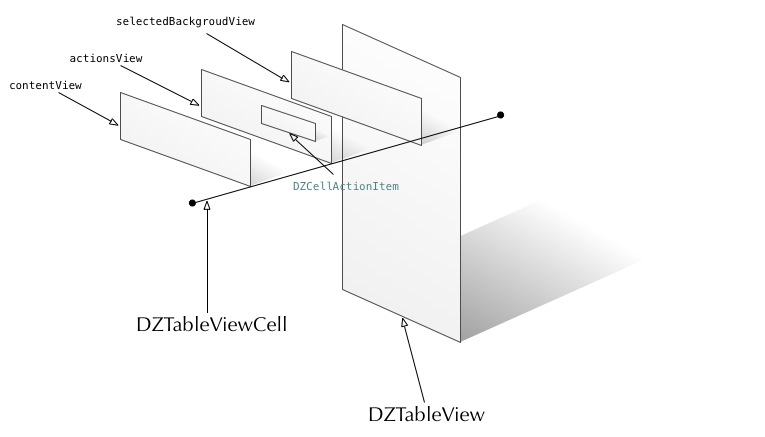

#解释一下整个UI的层次架构
下面这张图大概说明了整个DZTableView的View的结构树。

整个的TableView分成两个主要的组成部分:DZTableView和DZTableViewCell。这个结构和UITableView的结构是类似的。

DZTableView是tableView的主体部分，主要负责整个tableview的布局和渲染。而DZTableViewCell则是被布局和渲染的对象。DZTableView只是实现了y轴上纵向布局的tableView，没有分组。而我们通常看到的很多很炫的右滑删除等效果则是在DZTableViewCell上扩展得来的。

DZTableViewCell最基础的类主要有三个层次：

1. 负责渲染转中状态的selectedBackgroudView
2. 负责渲染和控制滑动效果的actionsView，actionsView上面各种功能的对象是DZCellActionItem
3. 负责渲染Cell主体内容的contentVIew。

而完成一个TableView主要的工作就是在UISCrollView上对cell进行合理的布局。