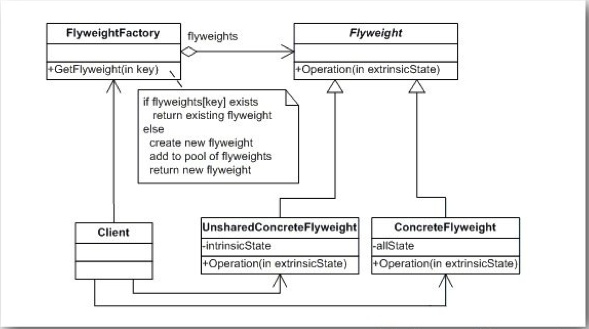

## Cell的重用


在使用UITableView的时候我们应该熟悉这样的接口：

```
- (id)dequeueReusableCellWithIdentifier:(NSString *)identifier

//ios6
- (id)dequeueReusableCellWithIdentifier:(NSString *)identifier forIndexPath:(NSIndexPath *)indexPath
```

在要使用一个Cell的时候我们先去看看tableView中有没有可以重用的cell，如果有就用这个可以重用的cell，只有在没有的时候才去创建一个Cell。这就是享元模式。

享元模式可以理解成，当细粒度的对象数量特别多的时候运行的代价会相当大，此时运用共享的技术来大大降低运行成本。比较突出的表现就是内容有效的抑制内存抖动的情况发生，还有控制内存增长。它的英文名字是flyweight，让重量飞起来。哈哈。名副其实，在一个TableView中Cell是一个可重复使用的元素，而且往往需要布局的cell数量很大。如果每次使用都创建一个Cell对象，系统的内容抖动会非常明显，而且系统的内存消耗也是比较大的。突然一想，享元模式只是给对象实例共享提供了一个比较霸道的名字吧。

一个典型的享元模式的UML图示例如下：


而在DZTableView中的实现中，享元模式中Cell的实例的存储和共享主要是在tableView中完成的。

```
 NSMutableSet*  _cacheCells;
 NSMutableDictionary* _visibleCellsMap;
```
我们定义了两个用来存储两种不同类型的cell的容器：

1. _cacheCells 存储不再使用过程中，可以被复用的cell
2. _visibleCellsMap 按照键值对的方式存储了在使用中的cell。key是cell的顺序信息，即是自上而下的第几个cell。

而我们获取一个cell的函数如下：

```
- (DZTableViewCell*) _cellForRow:(NSInteger)rowIndex
{
    DZTableViewCell* cell = [_visibleCellsMap objectForKey:@(rowIndex)];
    if (!cell) {
        cell = [_dataSource dzTableView:self cellAtRow:rowIndex];
        DZCellActionItem* deleteItem = [DZCellActionItem buttonWithType:UIButtonTypeCustom];
        deleteItem.backgroundColor = [UIColor redColor];
        [deleteItem addTarget:self action:@selector(deleteCellOfItem:) forControlEvents:UIControlEventTouchUpInside];
        [deleteItem setTitle:@"删除" forState:UIControlStateNormal];
        deleteItem.edgeInset = UIEdgeInsetsMake(0, 10, 0, 260);
        DZCellActionItem* editItem = [DZCellActionItem buttonWithType:UIButtonTypeCustom];
        editItem.edgeInset = UIEdgeInsetsMake(0, 80, 0, 180);
        editItem.backgroundColor = [UIColor greenColor];
        [editItem setTitle:@"编辑" forState:UIControlStateNormal];
        [editItem addTarget:self action:@selector(editCellOfItem:) forControlEvents:UIControlEventTouchUpInside];
        cell.actionsView.items = @[deleteItem,editItem ];
    }
    return cell;
}
```

我们分几种情况来说明一下在布局cell的时候cell的重用问题。
### 已经在界面上的cell
对于已经在界面的cell我们很明显没有必要去重新构建，甚至没有必要去数据源去要。直接获取到相应的cell就好了。

```
DZTableViewCell* cell = [_visibleCellsMap objectForKey:@(rowIndex)];
```

### 没有在界面上的cell
对于没有在界面的cell，我们就需要去数据那里去要：

```
cell = [_dataSource dzTableView:self cellAtRow:rowIndex];
```

数据源在处理这个请求的时候就是按照上面我们说的享元模式的规则来了：

```
- (DZTableViewCell*) dzTableView:(DZTableView *)tableView cellAtRow:(NSInteger)row
{
    static NSString* const cellIdentifiy = @"detifail";
    DZTypeCell* cell = (DZTypeCell*)[tableView dequeueDZTalbeViewCellForIdentifiy:cellIdentifiy];
    if (!cell) {
        cell = [[DZTypeCell alloc] initWithIdentifiy:cellIdentifiy];
    }
    NSString* text = _timeTypes[row];
    return cell;
}
```
先去看看tableView中有没有可以重用的cell，有就用，没有就新建。但是tableView是怎么知道有可以重用的cell的呢。
#### DZTableView 可重用cell的cache
首先我们看一下获取重用cell的函数：

```
- (DZTableViewCell*) dequeueDZTalbeViewCellForIdentifiy:(NSString*)identifiy
{
    DZTableViewCell* cell = Nil;
    for (DZTableViewCell* each  in _cacheCells) {
        if ([each.identifiy isEqualToString:identifiy]) {
            cell = each;
            break;
        }
    }
    if (cell) {
        [_cacheCells removeObject:cell];
    }
    return cell;
}
```

很明显我们去_cacheCells中检查有没有特定identifiy的cell存在，如果有就说明有可重用的cell。这是一个直接获取的过程，那么久必然会存在往里面放cell的过程。


```
- (void) layoutNeedDisplayCells
{
    ...
    [self cleanUnusedCellsWithDispalyRange:displayRange];
    ...
}
- (void) cleanUnusedCellsWithDispalyRange:(NSRange)range
{
    NSDictionary* dic = [_visibleCellsMap copy];
    NSArray* keys = dic.allKeys;
    for (NSNumber* rowIndex  in keys) {
        int row = [rowIndex intValue];
        if (!NSLocationInRange(row, range)) {
            DZTableViewCell* cell = [_visibleCellsMap objectForKey:rowIndex];
            [_visibleCellsMap removeObjectForKey:rowIndex];
            [self enqueueTableViewCell:cell];
        }
    }
}
```
我们在布局完cell的时候，回去清理界面上无用的cell。同时把这些cell放入可重用cell的容器中。等待下次使用的时候，复用。

#### DZTableViewCell相关
当然，如果只是DZTableView单方面的想去重用cell是不肯能的。我们需要对DZTableViewCell做一些处理，才能够让这套享元模式运转起来。上面的代码中我们已经看到了，我们为DZTableViewCell添加了一些属性:

```
//DZTableViewCell_private.h
@interface DZTableViewCell ()
@property (nonatomic, strong) NSString* identifiy;
@property (nonatomic, assign) NSInteger index;
@end
```
identifiy标识了这个cell的种类。方便我们复用同一种类的cell。因为DZTableViewCell上可能会存在多种不同种类的cell，如果没有标识的重用起来就不知道获取到的cell是否能够适应特定的种类了。

还有一个index信息，这个是cell的顺序信息，主要是为了方便定位cell的位置用的。

值得注意的是这个定义是以Catogory的方式，定义在DZTableViewCell_private.h文件中的，而该文件只在DZTableView.mm中被引用，这样就避免了上面这些属性暴露给使用者，方式使用者使用方式不当导致的问题。或句话说，这些都是私有变量。必须被保护起来。

同时我们还定义和实现了一个函数：

```
- (void) prepareForReused;
....
- (void) prepareForReused
{
    _index = NSNotFound;
    [self setIsSelected:NO];
}
```
既然我们要复用一个Cell，那么就得在复用之前把Cell清理干净把，不然带着老数据去使用，用着用着就乱了，你就不知道cell的数据是对的还是错的了。
