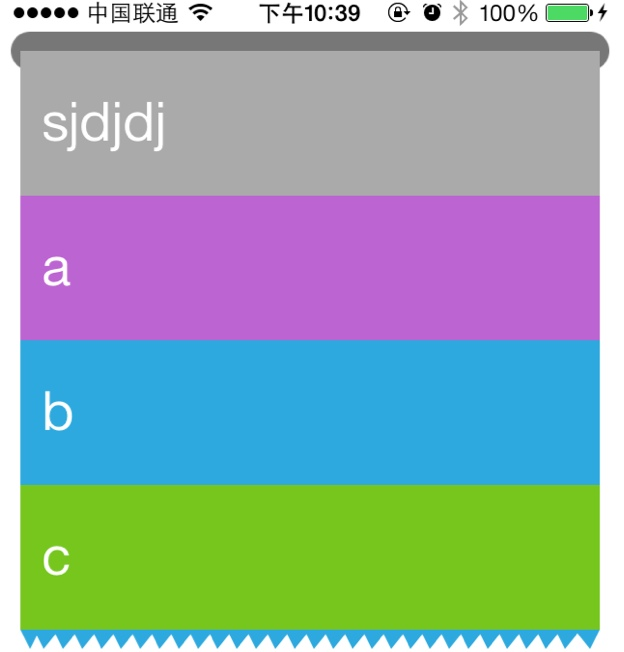

#实现TableView
好了在上面的工作准备的差不多了之后，我们大概了解了UIKit给我们提供了一些什么基础的工具。貌似我们就可以大刀阔斧的开始搞了。不对，等等，貌似我们缺了掉什么。好像是设计模式相关的东西，比如享元模式、责任链模式等等。这些东西就在我们用的时候，说一下吧。读者也可以照一本设计模式的书放在身边，以备不时之需。

项目相关的代码可以从：[DZTableView](https://github.com/yishuiliunian/DZTableView)获取。

先看个效果图：

先说一下我们都实现了些什么东西：

1. 基本的TableView对Cell的布局
2. Cell的增加和删除
3. 右滑出现删除和编辑菜单
4. 下拉输入并新建一个cell

废话不多说开始干活！！！

##1. [解释一下整个UI的层次架构](gemotry.md)
##2. [子类化UIScrollView实现对Cell的布局](subclassScrollView.md)
##3. [Cell的重用](shareCell.md)
##4. [响应和处理事件](event.md)
##5. [在DZTableViewCell上扩展功能](cell.md)
##6. [接口和数据获取](interface.md)