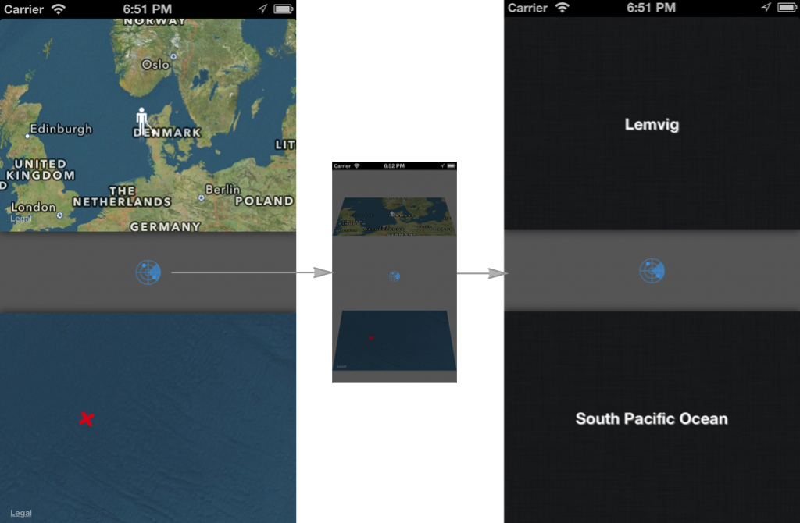

在 iOS 5.0 以前，视图控制器容器只属于苹果系统所有，苹果不建议你自定义视图控制器容器。实际上，在视图控制器编程指南这一章中明确告知我们不要使用它。以前苹果公司对于视图控制器容器的总体描述是“一个管理整个屏幕内容的视图控制器”，而现在的描述是“一个包含本身视图内容的单元集合”。为什么苹果不希望我们自定义像tab bar controllers 和navigation controllers这样的视图控制器容器呢？更准确的说，下面这条语句会带来什么问题：

```
[viewControllerA.view addsubView:viewControllerB.view]
```

UIWindow作为应用程序的根视图，负责监听和分发屏幕旋转和视图布局等消息。在上图中，ViewController的view插入到根视图控制器当中的一个视图中作为其子视图，那么这个view就不会再接收到UIWindow传来的消息，像viewWillAppear：这种方法就不会被调用。

在ios5.0以前我们自定义的视图控制器容器，将会持有子类视图控制器的一个引用，并且需要我们手动的传递在父类视图控制器中调用的事件消息给子类视图控制器，准确地完成这项工作太难了！


实例详解:

小时候你在沙滩玩耍时，你的父母是否曾告诉过你：如果你用你的小铁锹一直挖，一直挖，最终你能挖到地球对面的中国去(作者在美国)。我父母曾这样给我说过，我做了一个叫Tunnel的应用来检验一下这个观点。你可以附加上GitHub Repo并运行这个程序，这样可以更好的帮助你理解这个实例。



如果想获得当前位置相对面的地点(地球的对面)，移动拿着铁锹的那个小人，地图会告知你准确的出口位置。触摸一下雷达按钮，地图就会翻转并显示确切的地名。

在当前的屏幕上，有两个地图视图控制器，每个都需要处理拖拽，标注位置，还有更新地图这些事件。翻转页面后会呈现对面地点的两个地图视图控制器。所有的这些视图控制器都存在于一个父类视图控制器容器中，这些视图控制器持有各自的视图，以确保视图的布局和翻转可以正确的进行。

根视图控制器拥有两个视图容器，添加两个的目的就是为了更方便各自容器的子视图进行布局，执行动画等操作，下面我们来解释一下。

```
- (void)viewDidLoad
{
    [super viewDidLoad];
 
    //Setup controllers
    _startMapViewController = [RGMapViewController new];
    [_startMapViewController setAnnotationImagePath:@"man"];
    [self addChildViewController:_startMapViewController];          //  1
    [topContainer addSubview:_startMapViewController.view];         //  2
    [_startMapViewController didMoveToParentViewController:self];   //  3
    [_startMapViewController addObserver:self
                              forKeyPath:@"currentLocation"
                                 options:NSKeyValueObservingOptionNew 
                                 context:NULL];
 
    _startGeoViewController = [RGGeoInfoViewController new];        //  4
}
```

_startMapViewController用来显示开始的位置，先实例化并用标注图片初始化。

1. _startMapViewController作为根视图控制器的一个子视图，添加到其中，子类中的willMoveToParentViewController:方法将会自动执行。

2. 上面的子类视图作为第一个视图容器的视图的子视图添加到其中。

3. 子视图收到一个通知，它现在有了一个父视图。

4. 进行地理位置编码的子视图控制器被初始化，但是现在还没有被插入到任何视图或控制器结构中。

布局

根视图控制器定义的两个视图容器分别决定了它们的子视图控制器的大小。子类视图控制器不知道自己将会添加到哪个视图容器中，所以它们的size大小必须可变的。


```
- (void) loadView
{
    mapView = [MKMapView new];
    mapView.autoresizingMask = UIViewAutoresizingFlexibleWidth |UIViewAutoresizingFlexibleHeight;
    [mapView setDelegate:self];
    [mapView setMapType:MKMapTypeHybrid];
 
    self.view = mapView;
}
```

现在它们会以父类视图的bounds来布局，这样增加了子类视图的复用性，如果我们把它推入导航控制器栈中，它们依然会正确的布局。

 转换效果

Apple提供的视图控制器容器的API是如此的详细，以至于我们几乎可以以我们能想到的任意方式来初始化容器或者执行各种动画。Apple还提供了方便使用的block方法来交换当前屏幕上的两个视图。


transitionFromViewController:toViewController:
上面这个方法为我们揭示了许多细节

```
- (void) flipFromViewController:(UIViewController*) fromController 
               toViewController:(UIViewController*) toController  
                  withDirection:(UIViewAnimationOptions) direction
{
    toController.view.frame = fromController.view.bounds;                           //  1
    [self addChildViewController:toController];                                     //  
    [fromController willMoveToParentViewController:nil];                            //  
 
    [self transitionFromViewController:fromController
                      toViewController:toController
                              duration:0.2
                               options:direction | UIViewAnimationOptionCurveEaseIn
                            animations:nil
                            completion:^(BOOL finished) {
 
                                [toController didMoveToParentViewController:self];  //  2
                                [fromController removeFromParentViewController];    //  3
                            }];
}
```

1.我们添加的toViewController执行动画之前，fromViewController会收到一个将会移除的通知，如果fromViewController是容器视图等级的视图，那么此时控制器的viewWillDisappear:方法将会被调用。

2.toViewController接收到来自父类视图的消息，其对应的方法会被调用。

3.fromViewController被移除。

上面的这个方法，可以自动转换出旧的视图并替换成新的视图。如果你想实现你自己的转换方法，并且想让每一个时刻都只能显示一个视图，你必须对旧的视图调用removeFromSuperview方法，新的视图调用addSubview:方法。调用方法的次序如果出错将会导致UIViewControllerHierarchyInconsistency警告。比如在你添加视图之前调用视图的didMoveToParentViewController:将会出错。

为了能够使用 UIViewAnimationOptionTransitionFlipFromTop动化序列，我们必须把子类视图添加到视图容器控制器上，而不是添加到根视图控制器上，否则的化，执行动画将会导致整个根视图翻转。

通信

视图控制器应该是能够复用，包含当前视图的一个实体，子类视图也应该遵循这一经验法则。为了遵循这一法则，父类视图控制器应该只负责两个任务：布局子类视图控制器的根视图，通过自身暴露的API接口与子类视图控制器通信，不应该直接修改子类视图的树形结构和状态。

在Tunnel应用实例中，父类视图控制器会适时监听map view controllers当中的currentLocation属性。

```
[_startMapViewController addObserver:self 
                          forKeyPath:@"currentLocation"
                             options:NSKeyValueObservingOptionNew
                             context:NULL];
```

在地图旁边拿着铁锹的小男孩移动时，相应的属性就会变化，这时父类视图控制器将新的位置相对的(地球对面)的地点传递给另一个地图。

类似地，当你点击雷达按钮，父类视图控制器在新的子类视图控制器中设置与以前位置对应的地理位置。

```
[_startGeoViewController setLocation:_startMapViewController.currentLocation];
[_targetGeoViewController setLocation:_targetMapViewController.currentLocation];
```
尽量选择独立的方法来完成子类视图与父类视图的通信(KVO, 通知中心, 代理模式)，这与上面提到的通信法则一致，即子类视图控制器应该独立，并且具有复用性。在我们的例程中，我们可以把一个视图控制器压入到导航控制器栈中，但是通信接口仍然选择相同的API。

