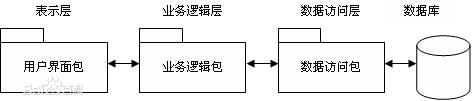

三层架构(3-tier architecture) 通常意义上的三层架构就是将整个业务应用划分为：表现层（UI）、业务逻辑层（BLL）、数据访问层（DAL）。区分层次的目的即为了“高内聚，低耦合”的思想。

1. 表现层（UI）：通俗讲就是展现给用户的界面，即用户在使用一个系统的时候他的所见所得。
2. 业务逻辑层（BLL）：针对具体问题的操作，也可以说是对数据层的操作，对数据业务逻辑处理。
3. 数据访问层（DAL）：该层所做事务直接操作数据库，针对数据的增添、删除、修改、查找等。

##表示层

位于最外层（最上层），最接近用户。用于显示数据和接收用户输入的数据，为用户提供一种交互式操作的界面。
业务逻辑层

##业务逻辑层（Business Logic Layer）
无疑是系统架构中体现核心价值的部分。它的关注点主要集中在业务规则的制定、业务流程的实现等与业务需求有关的系统设计，也即是说它是与系统所应对的领域（Domain）逻辑有关，很多时候，也将业务逻辑层称为领域层。例如Martin Fowler在《Patterns of Enterprise Application Architecture》一书中，将整个架构分为三个主要的层：表示层、领域层和数据源层。作为领域驱动设计的先驱Eric Evans，对业务逻辑层作了更细致地划分，细分为应用层与领域层，通过分层进一步将领域逻辑与领域逻辑的解决方案分离。
业务逻辑层在体系架构中的位置很关键，它处于数据访问层与表示层中间，起到了数据交换中承上启下的作用。由于层是一种弱耦合结构，层与层之间的依赖是向下的，底层对于上层而言是“无知”的，改变上层的设计对于其调用的底层而言没有任何影响。如果在分层设计时，遵循了面向接口设计的思想，那么这种向下的依赖也应该是一种弱依赖关系。因而在不改变接口定义的前提下，理想的分层式架构，应该是一个支持可抽取、可替换的“抽屉”式架构。正因为如此，业务逻辑层的设计对于一个支持可扩展的架构尤为关键，因为它扮演了两个不同的角色。对于数据访问层而言，它是调用者；对于表示层而言，它却是被调用者。依赖与被依赖的关系都纠结在业务逻辑层上，如何实现依赖关系的解耦，则是除了实现业务逻辑之外留给设计师的任务。
数据层

##数据访问层：
有时候也称为是持久层，其功能主要是负责数据库的访问，可以访问数据库系统、二进制文件、文本文档或是XML文档。
简单的说法就是实现对数据表的Select，Insert，Update，Delete的操作。如果要加入ORM的元素，那么就会包括对象和数据表之间的mapping，以及对象实体的持久化。