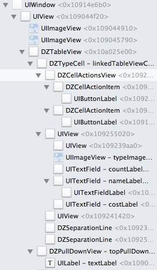

通过实现一个TableView来理解IOS UI编程
====
先说点题外话。我们在日常做和IOS的UI相关的工作的时候，有一个组件的使用频率非常高--UITabelView。于是就要求我们对UITableView的每一个函数接口，每一个属性都了如指掌，只有这样在使用UITableView的时候，我们才能游刃有余的处理各种需求。不然做出来的东西，很多时候只是功能实现了，但是程序效率和代码可维护性都比较差。举个例子，比如在tableView头部要显示一段文字。我见过的最啰嗦的解决方案是这样的：

1. 子类化一个UIViewController
2. 将根View设置成一个UIScrollView
3. 把头部的Label和TableView加在ScrollView上面
4. 开始各种调整ScrollView和TableView的delegate调用函数里面的参数，让Label能随着TableView滑动

其实如果你熟悉UITableView，那么你几句话就可以搞定

```
    UILabel* label = [UILabel alloc] initWithFrame:CGRectMake(0, 0, CGRectGetWidth(self.view.frame), 40);
    label.text = @"就是一段文字嘛，干嘛大动干戈";
    tableVIew.tableHeaderView = label;
```

所谓工欲善其事必先利器，编程语言和各种库其实本质上就是工具而已。你要想用这些工具来实现产品和Leader提出的各种需求。当然，不止是功能上的实现，还包括程序效率，代码质量。特别想着重强调一下代码质量，如果你不想后面维护自己的代码就像噩梦一样，如果你不想一旦新来一个需求就得对代码大刀阔斧的伤筋动骨，如果你不想给后来者埋坑。那么最好就多注意一下。

这里的代码质量并不是简简单单的指代码写点注释了，利用Xcode提供的一些像pragam或者#warning来解释代码。《编写可阅读代码的艺术》还有其他一些编程的书籍也都说道，真正高质量的代码，是不需要注释的。一个好的代码从逻辑上和结构上都是清晰的。我看到很多很难维护的代码都是因为逻辑结构混乱，和设计模式滥用导致的程序结构紊乱。分析其原因，就会发现很多时候，是因为写代码的人对所使用的工具（主要是objc和UIKit）不是非常熟悉，于是就写了很多凑出来的临时方案，简单的实现了功能。表面看起来挺好的，但是实际上代码已经外强中，骨子里都乱了。后期维护起来会让人痛不欲生。

同时，个人一直觉得对于搞IOS开发来说自己实现一遍TableView就像是一种成人礼一样。你能够通过实现一个UITableView来深入的理解UIKit的一些技术细节，对IOS UI编程所使用到的工具，有比较深入的了解。这样，写程序的时候才不会捉襟见肘。

言归正传。开始实现一个TableView。

#UIKit给我们提供的基础

又重复了一遍，工欲善其事必先利其器。那么我们就看一下UIKit为我们提供了那些好用的工具让我们来实现一个TableView（当然不是子类化一个UITableView了）。这里会牵扯到一个另外一个问题，可能有些读者会问为什么不从最最底层的开始做起，来实现一个TableView呢，比如从写一个图形界面库开始。这个从技术上来说，完全可以实现，但是仔细想想在Apple为我们提供了UIKit之后，如果我们不是写游戏的话，貌似完全没有必要重新造这个轮子啊。当然你要写游戏的话，那令当别论，请出门左转有开源的Cocoa2d，作者要是针对从最底层开始构建感兴趣可以看一下Cocoa2d的开源代码，想必肯定大有收获。对于我们实现一个主要在应用中使用的TableView来说，就没有必要重新造这个轮子了。我们主要从研究UIKit为我们提供的一些对象和功能开始。在研究的过程中，我们也会探讨一些UIKit在设计这个图形界面库的时候一些设计动机。但是，这里必须提醒读者的是，很多探讨只是我和一些朋友探讨的结果，虽然在我们看来是对的。但是可能苹果当初并不是这么想的，我还是写出来，也是做了一些思想斗争的，毕竟谁都想只把大家都认为是正确的东西提供给大家。我这样做是为了给读者提供另一种视角来理解UIKit这个非常牛的库。其中不对的地方，当然非常欢迎各位指正。其实我也把，些这些的过程看做了是我和你们一起来探讨UIKit。

##几何布局框架
《核心动画编程》的某个翻译版本把UIKit的布局模型翻译成了几何布局模型，这个词非常贴切，原始的英文是“struts and springs”。字面翻译就是结构和弹簧。其实说白了就是一种绝对布局模型，这种布局模型的核心数据就是一个对象的几何属性。所以翻译成几何布局模型还是比较贴切的。

在UIKit的几何布局模型中核心的一个数据结构是：```CGRect```，它确定了一个View（或者Layer，我们这里先只考虑View的情况，想不详细展开来说其他的）在父View中坐标系的绝对位置。

那让我们来看一下CGRect的定义：

```
/* Points. */

struct CGPoint {
  CGFloat x;
  CGFloat y;
};
typedef struct CGPoint CGPoint;

/* Sizes. */

struct CGSize {
  CGFloat width;
  CGFloat height;
};
typedef struct CGSize CGSize;

/* Rectangles. */

struct CGRect {
  CGPoint origin;
  CGSize size;
};
typedef struct CGRect CGRect;
```

我们发现其实一个CGRect中包含了一个原点（point）和一组宽高的信息（size）。其实一个CGRect就是描述了一个长方形的块，就像下图的红色方块一样的东西，我们的每一个View在坐标系中都会被表示为一个长方形的块状物。

比如我们有一个位置是{{10,10},{20,20}}的View：

```
UIView* aView = [UIView new];
aView.frame = CGRectMake(0, 0 , 100 ,100)
```
在它的父类的坐标系中展示如下图：


我们能够发现红色的View的frame信息所描述的几何位置，其实是其在父View坐标系中的绝对位置。死死的写在那里的。所以像UIKit这样的布局模型又叫绝对布局模型，如果你用过jave的Swing或者c++的QT，你可能会觉得这种绝对布局模型好麻烦，好啰嗦。没有布局管理器的概念，什么都是绝对的。但是只能说各有各的好处把。QT之类的有布局管理器的开发复杂界面的确方便，但是像在iphone这样的手机设备上，机器屏幕有限、设备性能有限，用绝对布局模型还是比较合适。苹果在IOS5之后也引入了一些相对布局的东西（autolayout）正好这里有篇文章是说其性能的[Auto Layout Performance on iOS](http://floriankugler.com/blog/2013/4/21/auto-layout-performance-on-ios)。读过之后你能发现自动布局在复杂界面情况下的性能的确比较差的。所以像UIKit这种比较原始的绝对布局在性能上还是有优势的。

扯回来，通过上图我们能够发现，UIKit的坐标系是一个二维平面坐标系，以左上角为原点，x轴横向扩展，y轴纵向向下扩展。y轴的防线可能和我们以前上学的时候，学的坐标系有点不太一样。这个估计是考虑在ios屏幕上布局的时候我们一般都是从上往下布局，y轴向下方便我们布局吧。既然知道了UIKit的坐标系统是一个二维平面坐标系统，那么我们以前学的很多几何知识就能够在这个坐标系统中尽情使用了。这里知识点太多不一而足，也是埋个伏笔，知道我们在些TableView的时候会用到很多几何上的知识。

同时，你可以把整个UIKit的View布局系统看成一个递归的系统，一个view在父view中布局，父view又在其父view中布局，最后直到在UIWindow上布局。这样递归的布局开来，就能构建起我们看到的app的界面。

##UIView相关函数
###通用的一些函数
先来说一些UIView的函数，我们着重讲一下和布局相关的，本着做一个TableView的目的嘛，先熟悉我们要用的，其他的读者慢慢看文档。
####1、 初始化函数 ```- (id)initWithFrame:(CGRect)aRect```

objc构建一个对象使用的是两段式，首先分配内存```alloc```然后```init```，这样的好处就是将内存操作和初始化操作解耦合，让我们能够在初始化的时候对对象做一些必要的操作。这是个很好的思路，我们在做很多事情的时候都可以使用这种两段式的思路。比如布局一个UIView，我们可以分成两部，初始化必要的子view和变量，然后在合适的时机进行布局。

而这个两段式的第一步就是：

```
- (id)initWithFrame:(CGRect)aRect
```

这个函数是无论你用什么初始化函数都会被调用的一个，比如你用```[UIView new]```或者```[[UIView alloc] init]```都会调用initWithFrame这个函数（有些UIView的子类有特殊情况，比如UITableViewCell，怀疑apple对其做过特殊处理），所以你要是对一个view的变量有初始化的操作尽量往```initWithFrame```里面放还是非常合适的。
这样能够保证，以后在使用的时候所有的变量都被正确的初始化过。而我们一般会在```initWithFrame```中做些什么呢？

1. 添加子View
2. 初始化属性变量
3. 其他一些共用操作

所以我们一般会看到这样的代码

```
- (instancetype) initWithFrame:(CGRect)arect
{
    self = [super WithFrame:arect];
    if (!self) {
        return nil;
    }
    [self commitInit];
    <#init data#>
    return self;
}

- (void) commomInit
{
    <#common init data#>
}
```

在初花的时候将一些共用的初始化操作独立成一个函数```commomInit```然后再其中做上面说的事情，这样做的好处就是将初始化的代码集中到一起，如果你在实现的一个其他的什么initWithXXX的时候，直接调用commonInit就可以了。

不得不说的是，千万不要被这个函数的名称withFrame给忽悠了，以为这个函数使用布局用的。在代码逻辑比较清晰的工程中，几乎很少看到在这个函数中进行界面布局的工作。因为UIKit给你提供了一个专门的函数layoutSubViews来干这个事情。而且，在这个函数中做的界面布局的工作，是一次性编码，你的界面布局没有任何复用性，如果父View的大小变了之后，这个View还是傻傻的保持原来的模样。同时也会造成，初始化函数臃肿，导致维护上的困难。

####2、```layoutSubviews```和```setNeedsLayout```

上面说了一些```initWithFrame```的事情，告诫了千万不要在里面做界面布局的事情，那应该在什么地方做呢？

```
layoutSubviews
```

就是这个地方，这是苹果提供给你专门做界面布局的函数。

我们来看一下文档:

```
The default implementation of this method does nothing on iOS 5.1 and earlier. Otherwise, the default implementation uses any constraints you have set to determine the size and position of any subviews.

Subclasses can override this method as needed to perform more precise layout of their subviews. You should override this method only if the autoresizing and constraint-based behaviors of the subviews do not offer the behavior you want. You can use your implementation to set the frame rectangles of your subviews directly.

You should not call this method directly. If you want to force a layout update, call the setNeedsLayout method instead to do so prior to the next drawing update. If you want to update the layout of your views immediately, call the layoutIfNeeded method.
```

苹果都说了这个是子类化View的时候布局用的。那我们最好是老老实实的在里面做布局的工作。
#####如何布局

这是个比较有意思的话题，因为可能很多人认为很简单，绝对布局嘛就是写一些死数字嘛，直接写CGRectMake(10,10,20,20)这样的坐标不就行了。如果你真这样认为，那么下面的话可能对你有帮助。

首先，尽量不要在布局的时候直接写死数字，比较稳妥的变法是使用常亮或者宏定义，甚至你定义一个临时变量也都ok，这样代码的可维护性就会变得比较好。

其次，谁说绝对布局的框架不能写成相对布局的方式。Apple提供了一个```CGGeometry.h```的文件，里面定义了大量的方便几何布局的函数。比如CGRectGetMaxX用来获取一个View的最大x坐标。你可能会问这有什么用？我们来看段代码：

```
    _imageView.frame = CGRectMake(0, 0, width, height);
    _textLabel.frame = CGRectMake(CGRectGetMaxX(_imageView.frame), 0, CGRectGetWidth(self.frame) - CGRectGetMaxX(_imageView.frame), CGRectGetHeight(self.frame));
```
下面那个_textLabel的布局就是在_imageView的大小而确定的。这不就是一些布局管理器做的事情吗，这不就是相对布局的概念嘛。所以我们完全可以使用UIKit的几何坐标系统完成一些相对布局的事情，而且也推荐这样做。
#####什么时候布局

这个就看功能需要了，不过有一点是肯定的就是不要直接调用layoutSubviews函数。UIKit和runtime是捆绑很密切的，apple为了防止界面重新布局过于频繁，所以只在runloop合适的实际来做布局的工作。里面具体的细节，可以google。

一般你需要重新布局的时候调用```setNeedsLayout```标记一下，“我需要重新布局了”。就行了，系统会在下次runloop合适的时机给你布局。

-----
####3、UIView层次树

不知道读者有没有试图想过当我们的一个程序真正运行起来的时候，那些被我们实例化的UIView和他们的子类们是以怎样的形态出现在我们的屏幕上的。前面我们介绍了IOS的几何布局框架，而通过这些框架组合起来的UIView和其子类们组成了什么东西？

是一个树形结构，或者准确说是一个倒金字塔结构。我们先看一张3D的DZTableView在只有一个Cell时候的结构图：

通过这张图我们能够非常明显的看到这是一个一层叠一层结构。最先面的是UIWindow的实例，我们的DZTableVIew还有其他一些自定义的控件们，一层叠一层的堆在了UIWindow的实例上面。我们再换个角度看一下：


这张图是个典型的树结构的图，一层层展开就是之后就是我们的DZTableView。通过这两张图比较形象的展示，出DZTableview最后在空间上成了一个什么东西。是的，是“空间”。用这两张图的主要目的就是，希望读者能够在自己的脑海中构建起对于UIView层次数Z-order（z轴）的概念。因为除了除了我布局UIView的各种子类的实例对象的时候，除了布局其二维属性```frame```等，其实我们还需要布局他们的3维属性，即Z-order顺序。

那我们来看看UIKit给我们提供了哪些函数来做这个事情：

```
– addSubview:
– bringSubviewToFront:
– sendSubviewToBack:
– removeFromSuperview
– insertSubview:atIndex:
– insertSubview:aboveSubview:
– insertSubview:belowSubview:
– exchangeSubviewAtIndex:withSubviewAtIndex:
– isDescendantOfView:

//属性部分
 superview  property
 subviews  property
 window  property
```

这些函数通过他们的名字很容易理解他们的意思。```addSubView:```直接将一个View附加在当前View上面。而这个附加过程，可以暂时先简单的理解成一个堆栈的PUSH操作。先附加的View被压在下面，后附加的View在最上面。在暂时把其他函数抛在一遍的情况下，和对堆栈的操作一样，我们是通过UIView的添加顺序（LILO）来控制视图的Z-Order的。但是和堆栈不同的是，UIView没有提供POP操作。因为实际上，解释一个视图中其子视图的比较好的模型是可随机访问的数组，类似于NSArray。不同的是，在父视图中没有直接删除子视图操作。删除操作下放给了我子视图。如果一个要移除一个视图，我们需要调用子视图的```removeFromSuperview```方法，来将其从父视图的层次数种移除。然后其他视图就像你在一堆积木中，抽了比较下面的一根一样，在其下放的保持原先的顺序不动，在其上方的自动下落，添补被抽离的积木造成的空缺，z-order的顺序自动减一。

我曾经思考过，为什么UIKit在设计的时候，不直接在父视图中完成所有的子视图层次数的操作，而是把删除的操作放到了子视图中。刚开始从设计的角度去考虑，像增删改查这些基本的操作不应该放在一起吗？放在一起的话，能够降低子视图和父视图之间的耦合。全部都在父视图中做了，子视图只是一个被统治而已。这样的模型比较简单，也比较好理解。后来在世界的编程实现中，慢慢体会到了apple那群牛逼的工程师的用心良苦。个人认为这绝对是他们对实际编程经验的一个提炼。我们在附加视图的时候，一半都是有了一个父视图的实例有了一个子视图的实例，然后将子视图附加在父视图上，而这个过程一半都是在父视图的类的某些成员函数中进行的。在父视图的成员函数中进行，我们能够非常方便的获取当前视图（父视图）和其子视图的实例，然后调用```addSubView```函数。而在删除的时候，我们一般都是在子视图中进行的。直接在子视图的类的某个函数中，当检测到子视图满足一定的状态的时候，将其删除。而在子视图中相对来说获取父视图的实例编程是比较啰嗦的：

```
//假设UIView存在一个函数removeSubView:那么这个过程是
[self.superView removeSubView:self]
//而removeSubView大概要做这么几个事情

....
- （void） removeSubView:(UIView*)a
{
	//确定是否有这个子视图
	if([self isContentSubView:a])
	{
		//找到子视图的Z-order
		int index = [self indexOfSubView:a];
		//删除掉
		[self removeSubViewAtIndex:index];
	}
}
```

何必要获取一遍父视图的实例进行删除操作呢，直接把这个过程封装起来，用一句：
```[self removeFromSuperView]```多好啊。
而且即使在父视图进行层次数操作的时候，也是有了子视图的实例之后进行操作：
```[aView removeFromeSuperView]```。这种封装，应该属于实用性的一种封装。细细品味，很有味道。

而其他的调整子视图的Z-Order的函数，通过函数名字我们也很容易理解。

1. ```insertSubview:atIndex:```直接将一个子视图加到特定的位置。
2. ```insertSubview:aboveSubview:```将一个子视图加到一个相对位置，在特定视图的上方。
3. ```insertSubview:belowSubview:```将一个子视图加到一个相对位置，在特定视图的下方。
4.  ```exchangeSubviewAtIndex:withSubviewAtIndex:```交换两个特定位置的视图
5.  ```bringSubviewToFront```将一个视图挪到最上方。
6.   ```sendSubviewToBack```将一个视图挪到最下方。

而我们其实在调整视图的Z-order的时候，是否想过调整Z-order用什么用呢？想当然的一个答案是，视图不就是层次结构的嘛，有个Z-order也很正常。但是，如果我们能够完全在二维平面中，完成对各种视觉结构的展示，就用不到三维结构。而偏偏我们这个世界是三维的，xyz三个轴才能确定一个物体。看一下那些优秀的游戏引擎把基本上都是直接用3D的模型来描述一个视觉对象。这种强3D的模型，能够接近真实的描述视觉结构，渲染出更加丰富多彩的虚拟世界。而UIKit中核心动画部分也是使用了类似于3D信息比较强的3D模型。所以，使用3D的模型来描述视觉结构师再正常不过的事情了，只是，在UIView这个层次上强3D的模型对于渲染界面来说，意义不是很大，只需要简单的保留一个z-order就OK了。这样利用xyz三个维度构建出来的UIKit的视图模型才能比较真实的拟合我们看到真实世界的例子。

举个例子，比如透明度这个事情。比如我们为了实现给一个UILabel加一个图片背景，我们会怎么做？

```
    UIImageView* imgView = [[UIImageView alloc] initWithImage:[UIImage imageNamed:@"a"]];
    [self.view addSubview:imgView];
    
    UILabel* label = [UILabel new];
    //将Label的背景设置成透明的，这样就能够看到label下面的图片了
    label.backgroundColor = [UIColor clearColor];
    [self.view addSubview:label];
```

我们会把Label的背景设置成透明的，这样label下放的图片自然就会显示出来。这和我们在真实3D世界中，通过玻璃看窗外一个道理。玻璃叠在了窗外的景色上面，但是当光纤映射到我们眼中时，我们看到的是一副图像。同样Label的例子在我们严重也是一个整体的图像。虽然在使用者严重他们不会在意你有Label了，label有透明度了。label后面还有图像了。他们只关心看在严重的整个图像看起来是个什么样子，但是对于我们开发者来说。我们需要一个恰当的模型来描述这种结构，而对于UIKit来说增加一个Z-order足矣，够用了。至于那些复杂的3D结构信息，交给更加底层的核心动画来处理吧。


--
####3、触摸事件响应相关函数
我们通常不是简单的把View布局到屏幕上就完事了。我们还需要提供能力让用户能与这些View进行交互。而在UIKit提供的框架中主要的就是触摸事件，当然还有摇晃了等其他一些事情，我们这里先不考虑，主要关于来自屏幕的事件和对其处理方式。

触摸事件是指我们对用户的手指触击屏幕以及在屏幕上移动时的一个抽象。从程序层面上讲就是，在用户发生上述行为时，系统不断发送给我们App的那些事件对象，然后按照特定的路径传递给我们App中的一些对象来处理。处理这些事件的对象主要有两类一个是UIViewController的子类和UIView的子类。在IOS中，我们用UITouch对象来表示一个触摸，而用UIEvent对象来描述一个事件。UIEvent事件对象中包含与一些列与用户操作相关的所有UITouch触摸对象，同时还可以提供与特定窗口相关联的触摸对象。其实，在实际的使用过程中，在UITouch和UIEvent两个对象中，我们使用比较多的一个对象是UITouch。所以我们这里先了解一下UITouch的都包含了那些用户触摸的数据。然后我们再来看看系统式如何传递这些事件并处理他们的。

#####UITouch对象解析

通过阅读[UITouch Class Reference](https://developer.apple.com/library/ios/documentation/uikit/reference/UITouch_Class/Reference/Reference.html)，我们看到在一个UITouch对象中主要是存储了与触摸用户触摸相关的信息：位置信息和时间信息。

```
//获取位置信息
– locationInView:
– previousLocationInView:
//获取时间信息，只读属性
timestamp  property
....
//其他
```
如果我们来对触摸进行抽象的话，也会主要在触摸对象中存储着两类信息。因为对于一个事件来说，大家公认的要素是：时间地点人物故事情节。在用户触摸屏幕这个事情上，人物是用户，故事情节就是开发者在app安排给用户的一些逻辑，这些都是更高层的抽象要关心的事情。而只有时间和地点（位置）是一个触摸对象必须关心的。有了这两方面的信息我们就能够确定，用户在什么时间触摸或触击了屏幕的哪个位置。位置新的的表示使用的CGPoint，对头，就是我们在集合布局框架中介绍的存储点信息的对象。但是UITouch对象存储的知识整个触摸或者触击时间的片段信息或者说状态信息。如果我们要完整的描述一个事件，我们需要一些列的UITouch对象。

假设一个事件有三个过程：从用户手指点到屏幕，在屏幕上移动，再到从屏幕上移开。那么这三个过程最少对对应三个UITouch对象。这就要说到我们是怎样处理触摸事件的了。

#####处理触摸事件

UIKit使用UIResponder作为响应对象，来响应系统传递过来的时间并进行处理。UIApplication、UIViewController、UIView、和所有从UIView派生出来的UIKit类（包括UIWindow）都直接或间接地继承自UIResponder类。

```
– touchesBegan:withEvent:
– touchesMoved:withEvent:
– touchesEnded:withEvent:
– touchesCancelled:withEvent:

```

##UIScrollView相关函数

UITableView的父类是UIScrollView。当然我们要实现一个TableView也需要继承自UIScrollView，那么我们就需要看一下UIScrollView的一些属性和方法。我可能嘴比较笨，一时半会也说不清楚，我就找了一篇解释UIScrollView比较好的文章：[Understanding Scroll Views](http://www.objc.io/issue-3/scroll-view.html).这里还有一个中文的翻译版本：[理解UISCrollView](http://mobile.51cto.com/hot-430409.htm)


#实现TABLEView
好了在上面的工作准备的差不多了之后，我们大概了解了UIKit给我们提供了一些什么基础的工具。貌似我们就可以大刀阔斧的开始搞了。不对，等等，貌似我们缺了掉什么。好像是设计模式相关的东西，比如享元模式、责任链模式等等。这些东西就在我们用的时候，说一下吧。读者也可以照一本设计模式的书放在身边，以备不时之需。

项目相关的代码可以从：[DZTableView](https://github.com/yishuiliunian/DZTableView)获取。

先看个效果图：


先说一下我们都实现了些什么东西：

1. 基本的TableView对Cell的布局
2. Cell的增加和删除
3. 右滑出现删除和编辑菜单
4. 下拉输入并新建一个cell

废话不多说开始干活！！！

##解释一下整个UI的层次架构
下面这张图大概说明了整个DZTableView的View的结构树。


整个的TableView分成两个主要的组成部分:DZTableView和DZTableViewCell。这个结构和UITableView的结构是类似的。

DZTableView是tableView的主体部分，主要负责整个tableview的布局和渲染。而DZTableViewCell则是被布局和渲染的对象。DZTableView只是实现了y轴上纵向布局的tableView，没有分组。而我们通常看到的很多很炫的右滑删除等效果则是在DZTableViewCell上扩展得来的。

DZTableViewCell最基础的类主要有三个层次：

1. 负责渲染转中状态的selectedBackgroudView
2. 负责渲染和控制滑动效果的actionsView，actionsView上面各种功能的对象是DZCellActionItem
3. 负责渲染Cell主体内容的contentVIew。


而完成一个TableView主要的工作就是在UISCrollView上对cell进行合理的布局。

##子类化UIScrollView实现对Cell的布局

解释一下为什么要从UIScrollView继承来完成TableView。这个和TableView的功能是密切相关的。TableView是一种内容数量大小不确定的布局方式，于是其需要在有限的屏幕（640*960）内展示无限的内容，而有这个功能的类就是UIScrollView。所以DZTableView从UIScrollView继承而来。

```
@interface DZTableView : UIScrollView
```
然后我们来看一下怎样去布局。分析一下，一个纵向的TableView布局的话，基本上是一个Cell接一个cell在纵向上确定他们的frame就能够布局出来了。那么我们的主要任务就是确定cell的位置。

为了确定cell的位置我们定义了一些变量：

```
typedef map<int, float> DZCellYoffsetMap;
typedef vector<float>   DZCellHeightVector;
.....
DZCellHeightVector _cellHeights;
DZCellYoffsetMap _cellYOffsets;
```
_cellHeights存储了所有cell的高度，而_cellYOffsets存储了每一个cell在y轴方向上的坐标。每一个cell在横向上是以填满为准的。即从View的最左侧开始布局（x=0）一直到最右侧右侧(width=view的宽度)。所以一般一个cell的绝对位置就是:

```
- (CGRect) _rectForCellAtRow:(int)rowIndex
{
    if (rowIndex < 0 || rowIndex >= _numberOfCells) {
        return CGRectZero;
    }
    float cellYoffSet = _cellYOffsets.at(rowIndex);
    float cellHeight  = _cellHeights.at(rowIndex);
    return CGRectMake(0, cellYoffSet - cellHeight, CGRectGetWidth(self.frame), cellHeight);
}
```
开始提到的几个关键的临时变量实在reduceContentSize函数中初始化的

```
- (void) reduceContentSize
{
    _numberOfCells = [_dataSource numberOfRowsInDZTableView:self];
    _cellYOffsets = DZCellYoffsetMap();
    _cellHeights = DZCellHeightVector();
    float height = 0;
    for (int i = 0  ; i < _numberOfCells; i ++) {
        float cellHeight = (_dataSourceReponse.funcHeightRow? [_dataSource dzTableView:self cellHeightAtRow:i] : kDZTableViewDefaultHeight);
        _cellHeights.push_back(cellHeight);
        height += cellHeight;
        _cellYOffsets.insert(pair<int, float>(i, height));
    }
    if (height < CGRectGetHeight(self.frame)) {
        height = CGRectGetHeight(self.frame) + 2;
    }
    height += 10;
    CGSize size = CGSizeMake(CGRectGetWidth(self.frame), height);
    
    [self setContentSize:size];
    [self reloadPiceGradientColor];
}
```

这样一来我们就能够确认每一个cell的在TableView中的绝对位置，以后无论是正常情况下的布局，或者在增加或者删除cell时的布局，就比较简单了。直接调用```_rectForCellAtRow```函数获取cell的frame，然后布局就ok了。
 
##Cell的重用
在使用UITableView的时候我们应该熟悉这样的接口：

```
- (id)dequeueReusableCellWithIdentifier:(NSString *)identifier

//ios6
- (id)dequeueReusableCellWithIdentifier:(NSString *)identifier forIndexPath:(NSIndexPath *)indexPath
```

在要使用一个Cell的时候我们先去看看tableView中有没有可以重用的cell，如果有就用这个可以重用的cell，只有在没有的时候才去创建一个Cell。这就是享元模式。

享元模式可以理解成，当细粒度的对象数量特别多的时候运行的代价会相当大，此时运用共享的技术来大大降低运行成本。比较突出的表现就是内容有效的抑制内存抖动的情况发生，还有控制内存增长。它的英文名字是flyweight，让重量飞起来。哈哈。名副其实，在一个TableView中Cell是一个可重复使用的元素，而且往往需要布局的cell数量很大。如果每次使用都创建一个Cell对象，系统的内容抖动会非常明显，而且系统的内存消耗也是比较大的。突然一想，享元模式只是给对象实例共享提供了一个比较霸道的名字吧。

一个典型的享元模式的UML图示例如下：


而在DZTableView中的实现中，享元模式中Cell的实例的存储和共享主要是在tableView中完成的。

```
 NSMutableSet*  _cacheCells;
 NSMutableDictionary* _visibleCellsMap;
```
我们定义了两个用来存储两种不同类型的cell的容器：

1. _cacheCells 存储不再使用过程中，可以被复用的cell
2. _visibleCellsMap 按照键值对的方式存储了在使用中的cell。key是cell的顺序信息，即是自上而下的第几个cell。

而我们获取一个cell的函数如下：

```
- (DZTableViewCell*) _cellForRow:(NSInteger)rowIndex
{
    DZTableViewCell* cell = [_visibleCellsMap objectForKey:@(rowIndex)];
    if (!cell) {
        cell = [_dataSource dzTableView:self cellAtRow:rowIndex];
        DZCellActionItem* deleteItem = [DZCellActionItem buttonWithType:UIButtonTypeCustom];
        deleteItem.backgroundColor = [UIColor redColor];
        [deleteItem addTarget:self action:@selector(deleteCellOfItem:) forControlEvents:UIControlEventTouchUpInside];
        [deleteItem setTitle:@"删除" forState:UIControlStateNormal];
        deleteItem.edgeInset = UIEdgeInsetsMake(0, 10, 0, 260);
        DZCellActionItem* editItem = [DZCellActionItem buttonWithType:UIButtonTypeCustom];
        editItem.edgeInset = UIEdgeInsetsMake(0, 80, 0, 180);
        editItem.backgroundColor = [UIColor greenColor];
        [editItem setTitle:@"编辑" forState:UIControlStateNormal];
        [editItem addTarget:self action:@selector(editCellOfItem:) forControlEvents:UIControlEventTouchUpInside];
        cell.actionsView.items = @[deleteItem,editItem ];
    }
    return cell;
}
```

我们分几种情况来说明一下在布局cell的时候cell的重用问题。
###已经在界面上的cell
对于已经在界面的cell我们很明显没有必要去重新构建，甚至没有必要去数据源去要。直接获取到相应的cell就好了。

```
DZTableViewCell* cell = [_visibleCellsMap objectForKey:@(rowIndex)];
```

###没有在界面上的cell
对于没有在界面的cell，我们就需要去数据那里去要：

```
cell = [_dataSource dzTableView:self cellAtRow:rowIndex];
```

数据源在处理这个请求的时候就是按照上面我们说的享元模式的规则来了：

```
- (DZTableViewCell*) dzTableView:(DZTableView *)tableView cellAtRow:(NSInteger)row
{
    static NSString* const cellIdentifiy = @"detifail";
    DZTypeCell* cell = (DZTypeCell*)[tableView dequeueDZTalbeViewCellForIdentifiy:cellIdentifiy];
    if (!cell) {
        cell = [[DZTypeCell alloc] initWithIdentifiy:cellIdentifiy];
    }
    NSString* text = _timeTypes[row];
    return cell;
}
```
先去看看tableView中有没有可以重用的cell，有就用，没有就新建。但是tableView是怎么知道有可以重用的cell的呢。
####DZTableView 可重用cell的cache
首先我们看一下获取重用cell的函数：

```
- (DZTableViewCell*) dequeueDZTalbeViewCellForIdentifiy:(NSString*)identifiy
{
    DZTableViewCell* cell = Nil;
    for (DZTableViewCell* each  in _cacheCells) {
        if ([each.identifiy isEqualToString:identifiy]) {
            cell = each;
            break;
        }
    }
    if (cell) {
        [_cacheCells removeObject:cell];
    }
    return cell;
}
```

很明显我们去_cacheCells中检查有没有特定identifiy的cell存在，如果有就说明有可重用的cell。这是一个直接获取的过程，那么久必然会存在往里面放cell的过程。


```
- (void) layoutNeedDisplayCells
{
    ...
    [self cleanUnusedCellsWithDispalyRange:displayRange];
    ...
}
- (void) cleanUnusedCellsWithDispalyRange:(NSRange)range
{
    NSDictionary* dic = [_visibleCellsMap copy];
    NSArray* keys = dic.allKeys;
    for (NSNumber* rowIndex  in keys) {
        int row = [rowIndex intValue];
        if (!NSLocationInRange(row, range)) {
            DZTableViewCell* cell = [_visibleCellsMap objectForKey:rowIndex];
            [_visibleCellsMap removeObjectForKey:rowIndex];
            [self enqueueTableViewCell:cell];
        }
    }
}
```
我们在布局完cell的时候，回去清理界面上无用的cell。同时把这些cell放入可重用cell的容器中。等待下次使用的时候，复用。

####DZTableViewCell相关
当然，如果只是DZTableView单方面的想去重用cell是不肯能的。我们需要对DZTableViewCell做一些处理，才能够让这套享元模式运转起来。上面的代码中我们已经看到了，我们为DZTableViewCell添加了一些属性:

```
//DZTableViewCell_private.h
@interface DZTableViewCell ()
@property (nonatomic, strong) NSString* identifiy;
@property (nonatomic, assign) NSInteger index;
@end
```
identifiy标识了这个cell的种类。方便我们复用同一种类的cell。因为DZTableViewCell上可能会存在多种不同种类的cell，如果没有标识的重用起来就不知道获取到的cell是否能够适应特定的种类了。

还有一个index信息，这个是cell的顺序信息，主要是为了方便定位cell的位置用的。

值得注意的是这个定义是以Catogory的方式，定义在DZTableViewCell_private.h文件中的，而该文件只在DZTableView.mm中被引用，这样就避免了上面这些属性暴露给使用者，方式使用者使用方式不当导致的问题。或句话说，这些都是私有变量。必须被保护起来。

同时我们还定义和实现了一个函数：

```
- (void) prepareForReused;
....
- (void) prepareForReused
{
    _index = NSNotFound;
    [self setIsSelected:NO];
}
```
既然我们要复用一个Cell，那么就得在复用之前把Cell清理干净把，不然带着老数据去使用，用着用着就乱了，你就不知道cell的数据是对的还是错的了。
##响应和处理事件

前面说过一个tableView应该是可交互的，而主要的交互就是能够确认用户点击了哪一个cell。

```
- (void) addTapTarget:(id)target selector:(SEL)selecotr
{
    self.userInteractionEnabled = YES;
    UITapGestureRecognizer* tapGesture = [[UITapGestureRecognizer alloc] initWithTarget:target action:selecotr];
    tapGesture.numberOfTapsRequired = 1;
    tapGesture.numberOfTouchesRequired = 1;
    [self addGestureRecognizer:tapGesture];
}
...
[self addTapTarget:self selector:@selector(handleTapGestrue:)];
...
- (void) handleTapGestrue:(UITapGestureRecognizer*)tapGestrue
{
    CGPoint point = [tapGestrue locationInView:self];
    NSArray* cells = _visibleCellsMap.allValues;
    for (DZTableViewCell* each in cells) {
        CGRect rect = each.frame;
        if (CGRectContainsPoint(rect, point)) {
            if ([_actionDelegate respondsToSelector:@selector(dzTableView:didTapAtRow:)]) {
                [_actionDelegate dzTableView:self didTapAtRow:each.index];
            }
            each.isSelected = YES;
            _selectedIndex = each.index;
        }
        else
        {
            each.isSelected = NO;
        }
    }
}
```
我们在tableview上面加了一个单机的事件UITapGestureRecognizer。然后再相应处处理了一下。主要是获取了用户点击位置，然后找到点击位置上的cell。这样就确认了用户点了哪个cell，在把这个信息传出去就好了。

##接口和数据获取
通过上面的阐述我们已经把DZTableView的框架搭起来了，实现了一个TableView的布局方式，还有cell的重用。但是还有一个非常关键的问题，tableView布局信息的数据怎么来，还有我们应该向外给提供者调用什么样的接口。

这个问题，貌似苹果已经做得很好了。而DZTableView要做的就是尽可能的让接口和苹果的保持一致，这样对于使用者而言，没有太大的学习成本。

###数据获取

```
@class DZTableView;
@class DZTableViewCell;
@class DZPullDownView;
@protocol DZTableViewSourceDelegate <NSObject>
- (NSInteger) numberOfRowsInDZTableView:(DZTableView*)tableView;
- (DZTableViewCell*) dzTableView:(DZTableView*)tableView cellAtRow:(NSInteger)row;
- (CGFloat) dzTableView:(DZTableView*)tableView cellHeightAtRow:(NSInteger)row;
@end
```

###点击等事件响应

```
@class DZTableView;
@class DZTableViewCell;
@protocol DZTableViewActionDelegate <NSObject>

- (void) dzTableView:(DZTableView*)tableView didTapAtRow:(NSInteger)row;
- (void) dzTableView:(DZTableView *)tableView deleteCellAtRow:(NSInteger)row;
- (void) dzTableView:(DZTableView *)tableView editCellDataAtRow:(NSInteger)row;

@end

```
###DZTableView的成员方法

```
- (DZTableViewCell*) dequeueDZTalbeViewCellForIdentifiy:(NSString*)identifiy;
- (void) reloadData;
- (void) insertRowAt:(NSSet *)rowsSet withAnimation:(BOOL)animation;
- (void) removeRowAt:(NSInteger)row withAnimation:(BOOL)animation;

- (void) manuSelectedRowAt:(NSInteger)row;
```

##在DZTableViewCell上扩展功能
###选中态
这个应该是所有View的一个基础功能，在很多基于UIView的空间上我们都能看到```setHeightlight```或者```setSelected```之类的函数，用来在用户选中该空间的时候，给用户一个反馈。DZTableViewCell的是```setSelected```。关于选中态主要有两部分的事情，一是选中时机，二是如何表现选中态。
####选中态的判断
选中太的判断主要是依靠触摸事件来判断，当用户触摸到cell的时候表示选中，用户手指离开的时候为不选中。于是我们通过重载UIView的一些列触摸事件的响应函数就能够做到对选中态的判断。

```
- (void) touchesBegan:(NSSet *)touches withEvent:(UIEvent *)event
{
    [super touchesBegan:touches withEvent:event];
    [self setIsSelected:YES];
}

- (void) touchesEnded:(NSSet *)touches withEvent:(UIEvent *)event
{
    [super touchesEnded:touches withEvent:event];
    [self setIsSelected:NO];
}

- (void) touchesCancelled:(NSSet *)touches withEvent:(UIEvent *)event
{
    [super touchesCancelled:touches withEvent:event];
    [self setIsSelected:NO];
}
```

####选中态的展示
回归一下刚开始的时候说到的，我们整个DZTableView的UIView数层次。一个Cell的最底层是一个_selectedBackgroudView。这个就是用来展示选中态的。当Cell的选中态改变的时候，我们只要重新布局一下_selectedBackgroudView就可以了。

```
- (void) setIsSelected:(BOOL)isSelected
{
    if (_isSelected != isSelected) {
        _isSelected = isSelected;
        [self setNeedsLayout];
    }
}
- (void) layoutSubviews
{
    ....
    if (_isSelected) {
        _selectedBackgroudView.frame = _contentView.bounds;
        _selectedBackgroudView.hidden =  NO;
        [_contentView insertSubview:_selectedBackgroudView atIndex:0];
    }
    else
    {
        _selectedBackgroudView.hidden = YES;
    }
    ....
```

#DZTableView的可扩展性探讨
既然我们要实现一个类似于UITableView一样非常通用的组件，也就要求DZTableView的可扩展性就要好一点。这包括：

1. 属性的可配置型
2. 功能上的扩展性，方便子类化

为了展示这个，特意做了右滑删除，还有下拉新建cell的功能。因为本文的主要目的是通过自己构建一个TableView来解释IOS UI编程。所以就不详细展开讨论。看一下代码大概就能明白了。